&nbsp;&nbsp;&nbsp;&nbsp;

&nbsp;&nbsp;&nbsp;&nbsp;

# Embabel DICE

Knowledge graph construction and reasoning library with proposition-based architecture and Prolog inference.

<p align="center">
  
</p>

<p align="center"><strong>Domain-Integrated Context Engineering</strong></p>

## What is DICE?

**DICE (Domain-Integrated Context Engineering)** extends context engineering by emphasizing the importance of a domain
model to structure context, and considering LLM outputs as well as inputs.

> Despite their seductive ability to work with natural language, LLMs become safer to use the more we add structure to
> inputs and outputs. DICE helps LLMs converse in the established language of our business and applications.
>
> Domain objects are not mere structs. They not only provide typing, but define focused behaviour. In an agentic system,
> behaviour can be exposed to manually authored code and selectively exposed to LLMs as tools.
>
> — [Context Engineering Needs Domain Understanding](https://medium.com/@springrod/context-engineering-needs-domain-understanding-b4387e8e4bf8)

### Benefits of Domain Integration

| Benefit                | Description                                                        |
|------------------------|--------------------------------------------------------------------|
| **Structured Context** | Use code to fill the context window—less delicate, more scientific |
| **System Integration** | Precisely integrate with existing systems using domain objects     |
| **Reuse**              | Domain models capture business understanding across agents         |
| **Persistence**        | Structured query via SQL, Cypher, Prolog—not just vector search    |
| **Testability**        | Structure and encapsulation facilitate testing                     |
| **Observability**      | Debuggers and tracing tools understand typed objects               |

## Architecture Overview

DICE uses a **proposition-based architecture** inspired by
the [General User Models (GUM)](https://arxiv.org/abs/2505.10831) research from Stanford/Microsoft. Like GUM, it
constructs confidence-weighted propositions that capture knowledge and preferences through a pipeline of Propose,
Retrieve, and Revise operations.

Natural language propositions are the system of record. They accumulate evidence and project to multiple typed views for
different use cases.

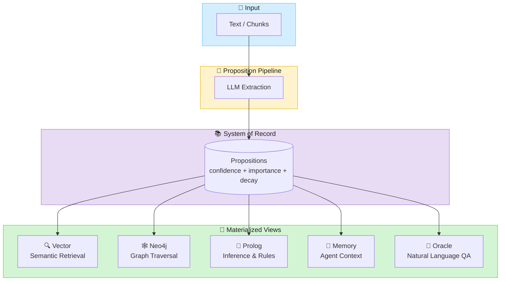

## Real-World Example: Impromptu

**[Impromptu](https://github.com/embabel/impromptu)** is a classical music exploration chatbot that uses DICE
to build a knowledge graph from conversations. It demonstrates production usage of:

- `PropositionPipeline` for extraction
- `IncrementalAnalyzer` for streaming conversation analysis
- `EscalatingEntityResolver` with `AgenticCandidateSearcher` for LLM-driven entity resolution
- Spring Boot integration with async processing

### Pipeline Setup (Spring Configuration)

```java
@Bean
PropositionPipeline propositionPipeline(
        PropositionExtractor propositionExtractor,
        PropositionReviser propositionReviser,
        PropositionRepository propositionRepository) {
    return PropositionPipeline
            .withExtractor(propositionExtractor)
            .withRevision(propositionReviser, propositionRepository);
}

@Bean
LlmPropositionExtractor llmPropositionExtractor(AiBuilder aiBuilder, ...) {
    return LlmPropositionExtractor
            .withLlm(llmOptions)
            .withAi(ai)
            .withPropositionRepository(propositionRepository)
            .withSchemaAdherence(SchemaAdherence.DEFAULT)
            .withTemplate("dice/extract_impromptu_user_propositions");
}
```

### Conversation Analysis (Event-Driven)

```java
@Async
@Transactional
@EventListener
public void onConversationExchange(ConversationAnalysisRequestEvent event) {
    // Build context with user-specific entity resolver
    var context = SourceAnalysisContext
            .withContextId(event.user.currentContext())
            .withEntityResolver(entityResolverForUser(event.user))
            .withSchema(dataDictionary)
            .withRelations(relations)
            .withKnownEntities(KnownEntity.asCurrentUser(event.user));

    // Wrap conversation and analyze incrementally
    var source = new ConversationSource(event.conversation);
    var result = analyzer.analyze(source, context);

    // Persist propositions and resolved entities
    result.persist(propositionRepository, entityRepository);
}
```

## Key Features

### Proposition Pipeline

- **Extraction**: LLM extracts typed propositions from text with confidence, importance, and decay scores
- **Entity Resolution**: Mentions resolve to canonical entity IDs
- **Evidence Accumulation**: Multiple observations reinforce or contradict propositions
- **Revision**: Merge identical, reinforce similar, contradict conflicting propositions
- **Promotion**: High-confidence propositions project to typed backends

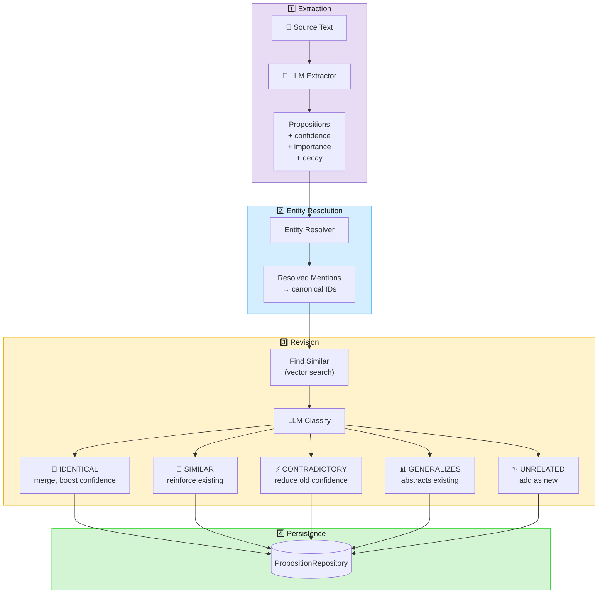

### Content Deduplication

DICE provides hash-based deduplication to prevent reprocessing identical content. This operates at
two levels: one-shot document ingestion and incremental (windowed) analysis.

#### How It Works

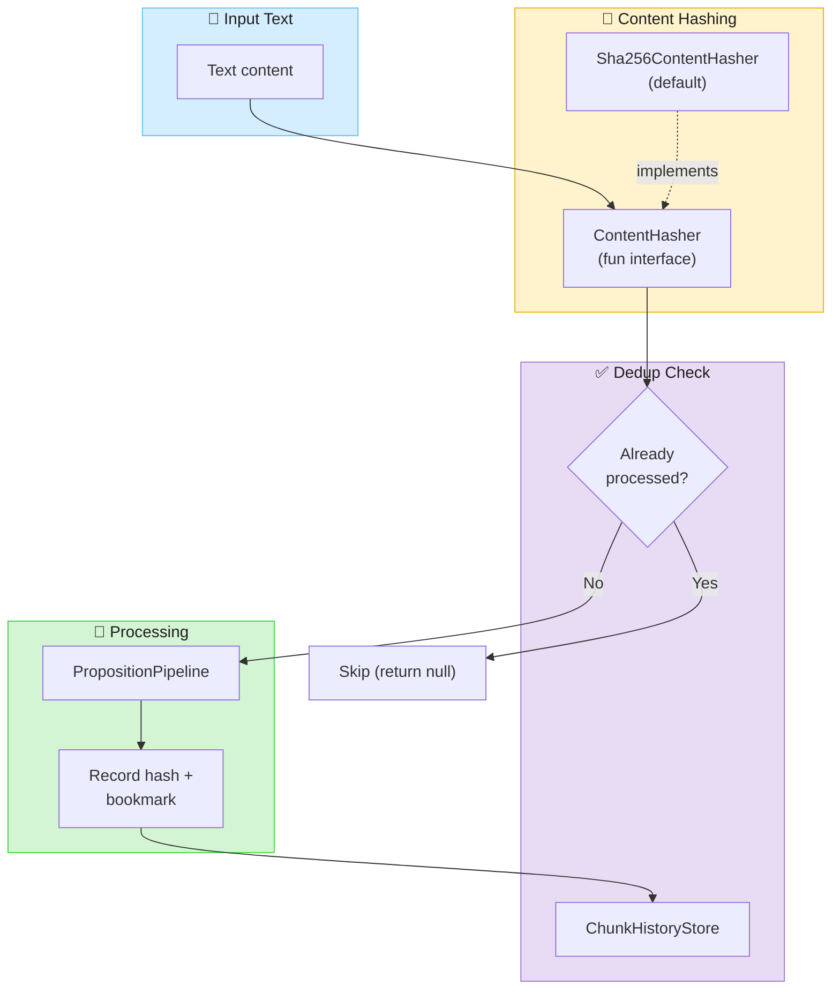

#### ContentHasher

The `ContentHasher` fun interface defines the hashing strategy. The default `Sha256ContentHasher`
produces SHA-256 hex strings, but you can substitute any strategy (e.g., for normalization or
locality-sensitive hashing):

```kotlin
// Default — SHA-256
val hasher: ContentHasher = Sha256ContentHasher

// Custom — e.g., normalize whitespace before hashing
val normalizingHasher = ContentHasher { text ->
    Sha256ContentHasher.hash(text.trim().replace("\\s+".toRegex(), " "))
}
```

#### One-Shot Ingestion with `processOnce`

For bulk-ingesting documents, notes, or other static text, use `PropositionPipeline.processOnce`.
It wraps the text in a `Chunk`, checks dedup, processes, and records — all in one call:

```kotlin
val pipeline = PropositionPipeline.withExtractor(extractor)
val historyStore = InMemoryChunkHistoryStore()  // or your persistent implementation

// First call: processes and records
val result = pipeline.processOnce(
    text = documentText,
    sourceId = "doc-123",
    context = context,
    historyStore = historyStore,
)

// Second call with same content: returns null (already processed)
val duplicate = pipeline.processOnce(
    text = documentText,
    sourceId = "doc-123",
    context = context,
    historyStore = historyStore,
)
assert(duplicate == null)
```

```java
// Java — processOnce with dedup
ChunkPropositionResult result = pipeline.processOnce(
    documentText, "doc-123", context, historyStore);

// Without dedup (no history store)
ChunkPropositionResult result = pipeline.processOnce(
    documentText, "doc-123", context);
```

#### Incremental Analysis Dedup

For growing sources (conversations, message streams), `AbstractIncrementalAnalyzer` applies
dedup automatically within its windowed processing. Each window's formatted text is hashed
and checked against the `ChunkHistoryStore` before processing:

```kotlin
val analyzer = PropositionIncrementalAnalyzer(
    pipeline = pipeline,
    historyStore = historyStore,
    formatter = MessageFormatter.INSTANCE,
    config = WindowConfig(windowSize = 20, overlapSize = 2, triggerInterval = 4),
    contentHasher = Sha256ContentHasher,  // pluggable
)

// Returns null if window content was already processed
val result = analyzer.analyze(source, context)
```

#### ChunkHistoryStore

The `ChunkHistoryStore` interface tracks what has been processed:

| Method | Description |
|--------|-------------|
| `isProcessed(contentHash)` | Check if content with this hash has been processed |
| `recordProcessed(record)` | Record a processed chunk (hash, sourceId, indices, timestamp) |
| `getLastBookmark(sourceId)` | Get the last analysis position for a source |

`InMemoryChunkHistoryStore` is provided for testing. Production implementations should
persist to a database for cross-session dedup.

### Mention Filtering

Mention filtering provides quality control for entity mentions extracted by the LLM. It prevents
low-quality mentions (vague references, overly long spans, duplicates) from polluting your knowledge graph.

#### Type-Safe Validation Rules

DICE provides compile-time checked validation rules that can be composed:

| Rule | Description | Example |
|------|-------------|---------|
| `NotBlank` | Rejects empty/whitespace mentions | Filters `"  "` |
| `NoVagueReferences()` | Rejects demonstratives | Filters `"this company"`, `"that person"` |
| `LengthConstraint()` | Enforces length limits | `LengthConstraint(maxLength = 150)` |
| `MinWordCount()` | Requires minimum words | `MinWordCount(2)` for person names |
| `PatternConstraint()` | Regex validation | Custom patterns |
| `AllOf()` | All rules must pass | Combine rules with AND |
| `AnyOf()` | At least one must pass | Combine rules with OR |

#### Schema-Driven Validation with DynamicType

Define validation rules directly in your schema using `ValidatedPropertyDefinition`:

```kotlin
import com.embabel.agent.core.*
import com.embabel.dice.common.validation.*

// Define entity types with type-safe validation rules
val companyType = DynamicType(
    name = "Company",
    description = "A business organization",
    ownProperties = listOf(
        ValidatedPropertyDefinition(
            name = "name",
            validationRules = listOf(
                NotBlank,
                NoVagueReferences(),
                LengthConstraint(maxLength = 150)
            )
        )
    ),
    parents = emptyList(),
    creationPermitted = true
)

val personType = DynamicType(
    name = "Person",
    description = "A person",
    ownProperties = listOf(
        ValidatedPropertyDefinition(
            name = "name",
            validationRules = listOf(
                NotBlank,
                MinWordCount(2),  // Require first + last name
                LengthConstraint(maxLength = 80)
            )
        )
    ),
    parents = emptyList(),
    creationPermitted = true
)

// Create DataDictionary from your types
val schema = DataDictionary.fromDomainTypes("my-schema", listOf(companyType, personType))
```

#### Configuring MentionFilter in the Pipeline

Use `SchemaValidatedMentionFilter` to apply schema-driven validation:

```kotlin
import com.embabel.dice.common.filter.*
import com.embabel.dice.pipeline.PropositionPipeline

// Create schema-driven filter
val mentionFilter = SchemaValidatedMentionFilter(schema)

// Configure pipeline with mention filter
val pipeline = PropositionPipeline
    .withExtractor(llmExtractor)
    .withMentionFilter(mentionFilter)
    .withRevision(reviser, repository)

// Process chunks - mentions are automatically filtered
val result = pipeline.process(chunks, context)
```

#### Context-Aware Filters

For filters that need proposition context (not just the mention span), use context-aware filters:

```kotlin
import com.embabel.dice.common.filter.*

// PropositionDuplicateFilter detects LLM field mapping errors
// (when the LLM copies the entire proposition as the mention span)
val mentionFilter = CompositeMentionFilter(listOf(
    SchemaValidatedMentionFilter(schema),  // Schema-driven validation
    PropositionDuplicateFilter()           // Catches LLM field mapping errors
))

// Configure pipeline
val pipeline = PropositionPipeline
    .withExtractor(llmExtractor)
    .withMentionFilter(mentionFilter)
```

#### Adding Observability with Metrics

Wrap any filter with `ObservableMentionFilter` for Micrometer metrics:

```kotlin
import io.micrometer.core.instrument.MeterRegistry

val observableFilter = ObservableMentionFilter(
    delegate = mentionFilter,
    meterRegistry = meterRegistry,
    filterName = "company-validation"  // Optional: custom metric tag
)

// Metrics recorded:
// - dice.mention.filter.total (counter)
// - dice.mention.filter.accepted (counter)
// - dice.mention.filter.rejected (counter, with rejection_reason tag)
```

#### What Gets Filtered

Given a company schema with `NoVagueReferences()` and `LengthConstraint(maxLength = 150)`:

✅ **Accepted:**
- `"OpenAI"` - Valid company name
- `"Microsoft Corporation"` - Valid, descriptive
- `"Goldman Sachs"` - Valid multi-word name

❌ **Rejected:**
- `"this company"` - Vague reference
- `"that investment"` - Vague reference
- `"A".repeat(200)` - Exceeds length limit
- `"   "` - Blank (if using `NotBlank`)

### Entity Extraction Pipeline

For use cases that need entity extraction without propositions, DICE provides a lightweight
`EntityPipeline` and `EntityIncrementalAnalyzer`. This is useful when you want to:

- Extract and resolve entities from conversations without creating propositions
- Build entity-only knowledge graphs
- Track entities mentioned in streaming data

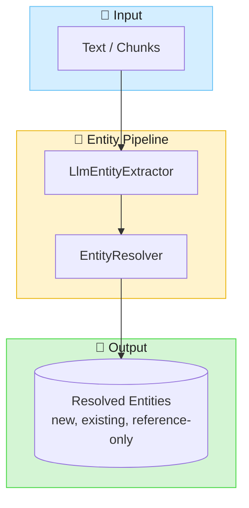

#### EntityExtractor

The `EntityExtractor` interface defines entity extraction from chunks:

```kotlin
interface EntityExtractor {
    fun suggestEntities(chunk: Chunk, context: SourceAnalysisContext): SuggestedEntities
}
```

Use `LlmEntityExtractor` for LLM-based extraction:

```kotlin
val extractor = LlmEntityExtractor
    .withLlm(llmOptions)
    .withAi(ai)

// Optionally use a custom prompt template
val customExtractor = extractor.withTemplate("my_entity_prompt")

val entities = extractor.suggestEntities(chunk, context)
```

#### EntityPipeline

The `EntityPipeline` orchestrates extraction and resolution:

```kotlin
// Create pipeline
val pipeline = EntityPipeline.withExtractor(
    LlmEntityExtractor.withLlm(llmOptions).withAi(ai)
)

// Process a single chunk
val result: ChunkEntityResult = pipeline.processChunk(chunk, context)

// Process multiple chunks (with cross-chunk entity resolution)
val results: EntityResults = pipeline.process(chunks, context)

// Persist extracted entities
results.persist(entityRepository)
```

The pipeline does NOT persist anything automatically—the caller controls persistence via the
`persist()` method or by accessing `entitiesToPersist()`.

#### EntityIncrementalAnalyzer

For streaming/incremental entity extraction (e.g., from conversations), use `EntityIncrementalAnalyzer`:

```kotlin
val analyzer = EntityIncrementalAnalyzer(
    pipeline = EntityPipeline.withExtractor(
        LlmEntityExtractor.withLlm(llmOptions).withAi(ai)
    ),
    historyStore = myHistoryStore,
    formatter = MessageFormatter.INSTANCE,
    config = WindowConfig(
        windowSize = 10,
        triggerThreshold = 3,
    ),
)

// Wrap conversation as incremental source
val source = ConversationSource(conversation)

// Analyze—returns null if trigger threshold not met
val result: ChunkEntityResult? = analyzer.analyze(source, context)

// Persist if we got results (also creates chunk-entity relationships)
result?.persist(entityRepository)
```

The `persist()` method saves entities and creates `(Chunk)-[:HAS_ENTITY]->(Entity)` relationships,
linking each extracted entity back to its source chunk for provenance tracking.

**Key differences from PropositionIncrementalAnalyzer:**

| Aspect | EntityIncrementalAnalyzer | PropositionIncrementalAnalyzer |
|--------|---------------------------|--------------------------------|
| Output | `ChunkEntityResult` | `ChunkPropositionResult` |
| Pipeline | `EntityPipeline` | `PropositionPipeline` |
| Creates | Entities only | Entities + Propositions |
| Use case | Entity tracking | Full knowledge extraction |

#### Entity Extraction Results

`ChunkEntityResult` and `EntityResults` implement `EntityExtractionResult`, providing access to:

```kotlin
// Individual chunk result
val chunkResult: ChunkEntityResult = pipeline.processChunk(chunk, context)

// Access entities by resolution type
chunkResult.newEntities()           // Newly created entities
chunkResult.updatedEntities()       // Matched to existing entities
chunkResult.referenceOnlyEntities() // Known entities (not modified)
chunkResult.resolvedEntities()      // All resolved (excludes vetoed)

// Get entities that need persistence
chunkResult.entitiesToPersist()     // new + updated

// Statistics
val stats = chunkResult.entityExtractionStats
println("${stats.newCount} new, ${stats.updatedCount} updated")

// Multi-chunk results (deduplicated)
val results: EntityResults = pipeline.process(chunks, context)
results.totalSuggested  // Total suggested across all chunks
results.totalResolved   // Unique resolved entities
```

### Entity Resolution

Entity resolution is the process of mapping entity mentions in text to canonical entities in a knowledge graph.
When an LLM extracts "Sherlock Holmes" from one document and "Holmes" from another, entity resolution determines
whether these refer to the same entity and links them to a single canonical ID.

#### Why Entity Resolution Matters

| Challenge | Without Resolution | With Resolution |
|-----------|-------------------|-----------------|
| **Duplicate entities** | "Alice", "Alice Smith", "Ms. Smith" → 3 entities | → 1 canonical entity |
| **Cross-document linking** | Entities isolated per document | Entities connected across corpus |
| **System integration** | Cannot link to existing databases | Ties into CRM, HR, product catalogs |
| **Graph quality** | Fragmented, redundant nodes | Clean, connected knowledge graph |

#### Resolution Outcomes

The `EntityResolver` interface returns one of four resolution types:

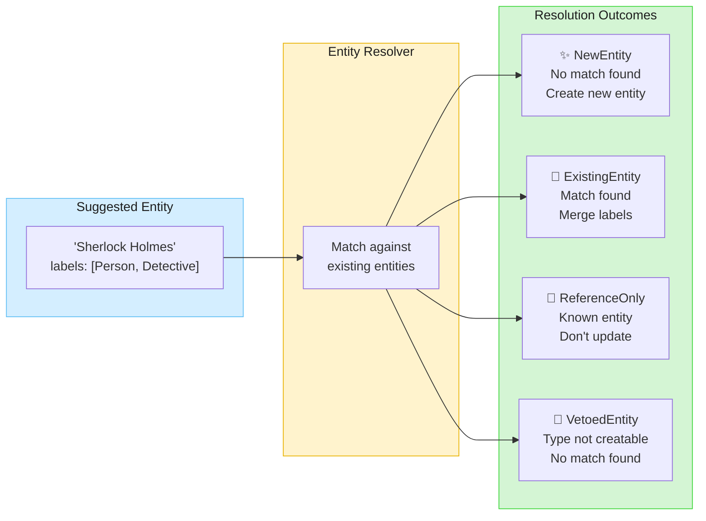

| Outcome | When | Result |
|---------|------|--------|
| **NewEntity** | No matching entity found | Create new entity with generated UUID |
| **ExistingEntity** | Match found in repository | Merge labels from suggested + existing |
| **ReferenceOnlyEntity** | Known entity (e.g., current user) | Reference existing, don't modify |
| **VetoedEntity** | Non-creatable type, no match | Entity rejected, not persisted |

#### Resolution Flow (Sequence Diagram)

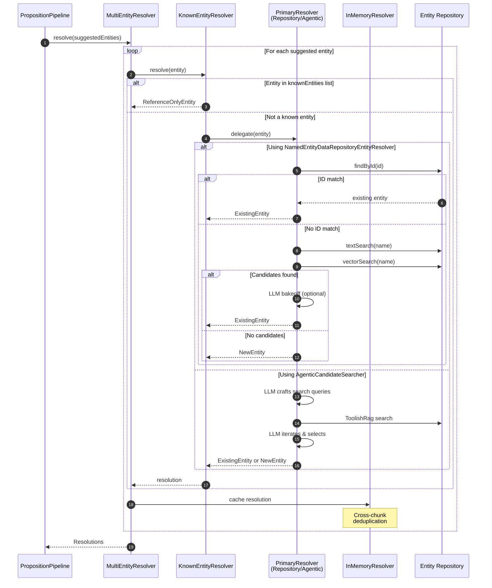

#### EntityResolver Implementations

DICE provides several `EntityResolver` implementations that can be composed:

| Implementation | Purpose | Use Case |
|----------------|---------|----------|
| **EscalatingEntityResolver** | **Recommended** - Escalating searcher chain with early stopping | Production, optimized performance |
| **InMemoryEntityResolver** | Session-scoped deduplication | Cross-chunk entity recognition |
| **ChainedEntityResolver** | Chain resolvers with fallback | Combine strategies |
| **KnownEntityResolver** | Fast-path for pre-defined entities | Current user, system entities |
| **AlwaysCreateEntityResolver** | Always creates new entities | Testing, baseline comparison |

##### Recommended Resolution Chain

The recommended setup uses `EscalatingEntityResolver` with `InMemoryEntityResolver` for cross-chunk deduplication:

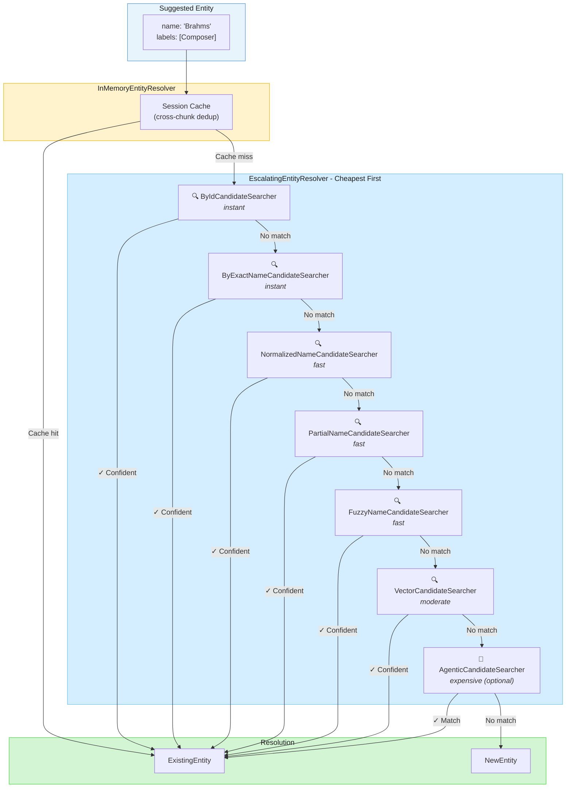

**Key design principles:**
- **Cheapest first** - ID lookup and exact match before expensive vector/LLM searches
- **Early stopping** - Returns immediately when a confident match is found
- **Exactly-one rule** - Searchers only return confident when exactly 1 result matches
- **Cross-chunk dedup** - `InMemoryEntityResolver` prevents duplicates across chunks

##### InMemoryEntityResolver

Maintains an in-memory cache of resolved entities within a processing session. Uses name matching
including exact, normalized, partial, and fuzzy matching:

```kotlin
val resolver = InMemoryEntityResolver(
    config = InMemoryEntityResolver.Config(
        maxDistanceRatio = 0.2,      // Levenshtein distance threshold
        minLengthForFuzzy = 4,       // Minimum length for fuzzy matching
        minPartLength = 4,           // Minimum part length for partial matching
    )
)
```

##### CandidateSearcher Interface

The `CandidateSearcher` interface represents a searcher that finds candidate entities:

```kotlin
interface CandidateSearcher {
    fun search(suggested: SuggestedEntity, schema: DataDictionary): SearchResult
}

data class SearchResult(
    val confident: NamedEntityData? = null,  // Confident match (stop early)
    val candidates: List<NamedEntityData> = emptyList(),  // All candidates found
)
```

Built-in searchers (ordered cheapest-first):

| Searcher | Purpose |
|----------|---------|
| `ByIdCandidateSearcher` | ID lookup (instant) |
| `ByExactNameCandidateSearcher` | Exact name match |
| `NormalizedNameCandidateSearcher` | Normalized names (removes "Dr.", "Jr.", etc.) |
| `PartialNameCandidateSearcher` | Partial matching ("Brahms" → "Johannes Brahms") |
| `FuzzyNameCandidateSearcher` | Levenshtein distance matching |
| `VectorCandidateSearcher` | Embedding/vector similarity |
| `AgenticCandidateSearcher` | LLM-driven search (expensive) |

Use `DefaultCandidateSearchers.create(repository)` for the standard chain (without agentic).

Create custom searchers by implementing the interface:

```kotlin
class MyCustomSearcher(private val myDataSource: MyDataSource) : CandidateSearcher {
    override fun search(suggested: SuggestedEntity, schema: DataDictionary): SearchResult {
        val match = myDataSource.findExact(suggested.name)
        return if (match != null) SearchResult.confident(match)
               else SearchResult.empty()
    }
}
```

##### EscalatingEntityResolver (Recommended)

**Performance-optimized resolver** that chains `CandidateSearcher`s, stopping early when confident.
Each searcher performs its own search and returns candidates. If a searcher returns a confident match,
resolution stops. Otherwise, candidates accumulate for optional LLM arbitration.

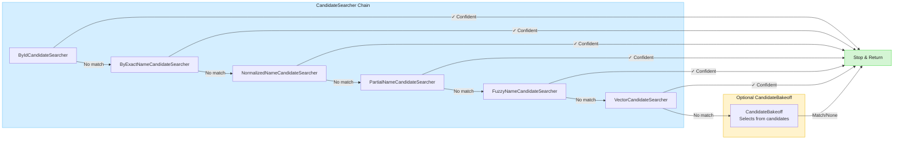

| Searcher | Strategy | Returns Confident When |
|----------|----------|------------------------|
| ByIdCandidateSearcher | ID lookup | Exactly 1 ID match |
| ByExactNameCandidateSearcher | Exact name match | Exactly 1 exact match |
| NormalizedNameCandidateSearcher | Normalized names | Exactly 1 normalized match |
| PartialNameCandidateSearcher | Partial names | Exactly 1 partial match |
| FuzzyNameCandidateSearcher | Levenshtein distance | Exactly 1 fuzzy match |
| VectorCandidateSearcher | Embedding similarity | Score ≥ 0.95 (exactly 1) |
| AgenticCandidateSearcher | LLM-driven search | LLM selects match |

```kotlin
// Simple: use factory method with defaults
val resolver = EscalatingEntityResolver.create(
    repository = entityRepository,
    candidateBakeoff = LlmCandidateBakeoff(ai, llmOptions, PromptMode.COMPACT),
)

// Custom: compose your own searcher chain
val resolver = EscalatingEntityResolver(
    searchers = DefaultCandidateSearchers.create(entityRepository),
    candidateBakeoff = LlmCandidateBakeoff(ai, llmOptions),
    contextCompressor = ContextCompressor.default(),
    config = EscalatingEntityResolver.Config(heuristicOnly = false),
)

// Without vector search
val resolver = EscalatingEntityResolver.withoutVector(entityRepository)

// Add bakeoff to existing resolver
val resolverWithBakeoff = resolver.withCandidateBakeoff(LlmCandidateBakeoff(ai, llmOptions))
```

**Context Compression** reduces LLM token usage by extracting only relevant snippets:

```kotlin
// Full context (500 tokens):
// "Hello! How are you? I've been listening to music. I really love Brahms.
//  His symphonies are incredible... [300 more tokens]"

// Compressed context (~50 tokens):
// "...I really love Brahms. His symphonies are incredible, especially..."

// Compressor options:
val compressor = WindowContextCompressor(windowChars = 100, maxSnippets = 3)
val compressor = SentenceContextCompressor(maxSentences = 3)
val compressor = AdaptiveContextCompressor()  // Chooses strategy by length
```

##### MultiEntityResolver (Composition)

Chain multiple resolvers with fallback logic:

```kotlin
val resolver = MultiEntityResolver(
    resolvers = listOf(
        knownEntityResolver,           // Fast path: check known entities first
        repositoryResolver,            // Primary: search repository
        InMemoryEntityResolver(...),   // Fallback: session cache
    )
)
// First ExistingEntity wins; otherwise first NewEntity
```

#### Match Strategies

`InMemoryEntityResolver` uses a chain of match strategies. Each returns `Match`, `NoMatch`, or `Inconclusive`:

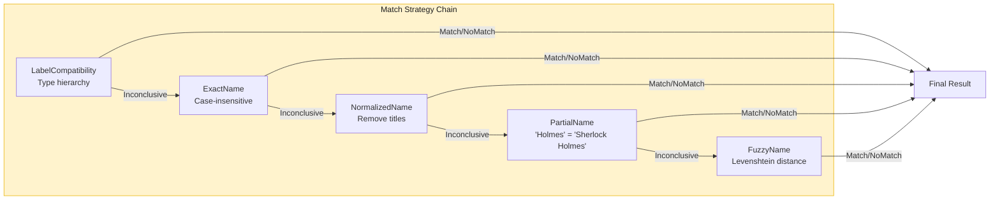

| Strategy | Description |
|----------|-------------|
| **CandidateBakeoff** | Interface for selecting best match from candidates |
| **LlmCandidateBakeoff** | LLM selects best from multiple candidates (COMPACT: ~100 tokens, FULL: ~400 tokens) |

#### Pipeline Integration

Entity resolution is integrated into the proposition pipeline via `SourceAnalysisContext`:

```kotlin
// Configure context with entity resolver
val context = SourceAnalysisContext
    .withContextId("session-123")
    .withEntityResolver(
        MultiEntityResolver(
            KnownEntityResolver(
                knownEntities = listOf(KnownEntity.asCurrentUser(currentUser)),
                delegate = repositoryResolver,
            ),
            InMemoryEntityResolver(defaultMatchStrategies()),
        )
    )
    .withSchema(dataDictionary)
    .withKnownEntities(KnownEntity.asCurrentUser(currentUser))

// Process chunks—entities automatically resolved
val result = pipeline.process(chunks, context)

// Access resolution results
result.chunkResults.forEach { chunkResult ->
    chunkResult.entityResolutions.resolutions.forEach { resolution ->
        when (resolution) {
            is NewEntity -> println("Created: ${resolution.recommended.name}")
            is ExistingEntity -> println("Matched: ${resolution.existing.name}")
            is ReferenceOnlyEntity -> println("Referenced: ${resolution.existing.name}")
            is VetoedEntity -> println("Rejected: ${resolution.suggested.name}")
        }
    }
}
```

### Entity Resolution Service

The `EntityResolutionService` exposes entity resolution as a **standalone typed service** — resolving entities,
creating new ones, and establishing relationships in the graph, independent of the proposition or entity extraction
pipelines. Use it when you have structured entity data (not raw text) to assert directly into the knowledge graph.

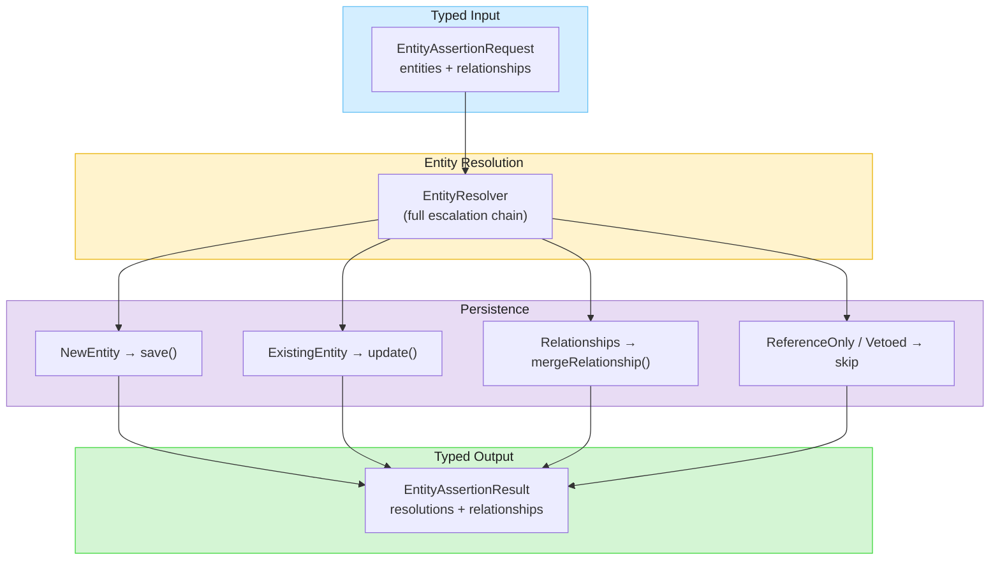

#### When to Use

| Scenario | Tool |
|----------|------|
| Raw text → entities + propositions | `PropositionPipeline` |
| Raw text → entities only | `EntityPipeline` |
| Structured data → entities + relationships | **`EntityResolutionService`** |

#### Usage

```kotlin
// Create the service
val service = EntityResolutionService(
    entityResolver = escalatingEntityResolver,
    repository = entityRepository,
    schema = dataDictionary,
)

// Assert entities and relationships
val result = service.resolve(EntityAssertionRequest(
    entities = listOf(
        EntityAssertion(
            name = "Alice Smith",
            labels = listOf("Person", "Engineer"),
            description = "Senior backend engineer",
            properties = mapOf("department" to "Platform"),
        ),
        EntityAssertion(
            name = "Acme Corp",
            labels = listOf("Company"),
            description = "Technology company",
        ),
    ),
    relationships = listOf(
        RelationshipAssertion(
            source = "Alice Smith",
            target = "Acme Corp",
            type = "WORKS_AT",
            description = "Full-time employee since 2020",
            properties = mapOf("since" to 2020),
        ),
    ),
))

// Inspect results
result.resolutions.forEach { res ->
    println("${res.name}: ${res.resolution} → ${res.entityId}")
}
result.relationships.forEach { rel ->
    println("${rel.source} -[${rel.type}]-> ${rel.target} (persisted=${rel.persisted})")
}
```

```java
// Java usage
var result = service.resolve(new EntityAssertionRequest(
    List.of(
        new EntityAssertion("Alice Smith", List.of("Person", "Engineer"),
            "Senior backend engineer", Map.of("department", "Platform")),
        new EntityAssertion("Acme Corp", List.of("Company"),
            "Technology company", Map.of())
    ),
    List.of(
        new RelationshipAssertion("Alice Smith", "Acme Corp", "WORKS_AT",
            "Full-time employee since 2020", Map.of("since", 2020))
    )
));
```

#### Resolution Outcomes

Each entity in the request receives one of four outcomes:

| Outcome | Action | Description |
|---------|--------|-------------|
| `NEW` | `repository.save()` | No existing match; new entity created |
| `EXISTING` | `repository.update()` | Matched existing entity; labels/properties merged |
| `REFERENCE_ONLY` | No persistence | Known entity referenced but not modified |
| `VETOED` | No persistence | Data dictionary does not permit creation for this type |

Relationships are persisted via `mergeRelationship()` (idempotent MERGE). A relationship
is skipped (`persisted=false`) if either its source or target entity was vetoed.

#### LLM Tools

`EntityResolutionTools` exposes entity resolution as `@LlmTool` methods that an LLM agent can invoke directly:

| Tool | Description |
|------|-------------|
| `assert_entities` | Assert entities only (resolve + persist) |
| `assert_entities_and_relationships` | Assert entities and create relationships between them |

```kotlin
// Create tools from an EntityResolutionService
val tools: List<Tool> = EntityResolutionTools.asTools(entityResolutionService)

// Add to an agent's tool set alongside other tools
val allTools = prologTools + tools
```

The LLM calls `assert_entities` with a JSON array of entities:

```json
{
  "entities": [
    {"name": "Alice Smith", "labels": ["Person", "Engineer"], "description": "Senior backend engineer"},
    {"name": "Acme Corp", "labels": ["Company"]}
  ]
}
```

Or `assert_entities_and_relationships` to also create relationships:

```json
{
  "entities": [
    {"name": "Alice Smith", "labels": ["Person"]},
    {"name": "Acme Corp", "labels": ["Company"]}
  ],
  "relationships": [
    {"source": "Alice Smith", "target": "Acme Corp", "type": "WORKS_AT"}
  ]
}
```

#### Spring Configuration

```java
@Bean
EntityResolutionService entityResolutionService(
        EntityResolver entityResolver,
        NamedEntityDataRepository entityRepository,
        DataDictionary dataDictionary) {
    return new EntityResolutionService(entityResolver, entityRepository, dataDictionary);
}
```

### Source Analysis Context

All DICE operations require a `SourceAnalysisContext` that carries configuration for source analysis:

| Property         | Description                                                          |
|------------------|----------------------------------------------------------------------|
| `schema`         | `DataDictionary` defining valid entity and relationship types        |
| `entityResolver` | Strategy for resolving entity mentions to canonical IDs              |
| `contextId`      | Identifies the source/purpose of the analysis (session, batch, etc.) |
| `knownEntities`  | Optional list of pre-defined entities to assist disambiguation       |
| `templateModel`  | Optional model data passed to LLM prompt templates                   |

### ContextId: The Starting Point for All Queries

The `ContextId` is a Kotlin value class that tags all propositions extracted during
a processing run. **ContextId is the primary scoping mechanism for all proposition queries**
and should be considered the starting point when retrieving knowledge.

| Scoping Pattern | Description | Example |
|-----------------|-------------|---------|
| **User-specific context** | Each user has their own context | `ContextId("user-alice-123")` |
| **Shared context** | Multiple users share knowledge | `ContextId("team-engineering")` |
| **Session context** | Per-conversation knowledge | `ContextId("session-abc")` |
| **Batch context** | Processing run grouping | `ContextId("batch-2025-01-09")` |

**Key design points:**

- One user can have **multiple contexts** (personal, team, project-specific)
- One context can be **shared between users** (team knowledge, organizational facts)
- ContextId is independent of entity identity—an entity like "Alice" can appear in many contexts
- Query by contextId first, then refine with entity, confidence, or temporal filters

```kotlin
// Create context for a processing run
val context = SourceAnalysisContext(
    schema = DataDictionary.fromClasses("myschema", Person::class.java, Company::class.java),
    entityResolver = AlwaysCreateEntityResolver,
    contextId = ContextId("user-session-123"),
)

// Process chunks with context
val result = pipeline.process(chunks, context)
```

> **Java Interop**: Since `ContextId` is a Kotlin value class, Java code should use the
> strongly-typed builder pattern and access the context ID via `getContextIdValue()`:
> ```java
> SourceAnalysisContext context = SourceAnalysisContext
>     .withContextId("my-context")
>     .withEntityResolver(AlwaysCreateEntityResolver.INSTANCE)
>     .withSchema(DataDictionary.fromClasses("myschema", Person.class))
>     .withKnownEntities(knownEntities)  // optional
>     .withTemplateModel(templateModel); // optional
> ```

### PropositionQuery: Composable Repository Queries

`PropositionQuery` provides a composable, Java-friendly builder pattern for querying propositions.
It consolidates filtering, ordering, and limiting into a single specification object.

```mermaid
flowchart LR
    subgraph Filters["Filters"]
        CTX["contextId<br/>(primary scope)"]
        ENT["entityId<br/>(mentions entity)"]
        MENT["anyEntityIds (OR)<br/>allEntityIds (AND)"]
        CONF["minEffectiveConfidence<br/>(with decay)"]
        IMP["minImportance<br/>(how much it matters)"]
        TIME["createdAfter/Before<br/>revisedAfter/Before"]
        LVL["minLevel/maxLevel<br/>(abstraction)"]
        STAT["status<br/>(ACTIVE, etc.)"]
    end

    subgraph Order["Ordering"]
        ORD["orderBy<br/>EFFECTIVE_CONFIDENCE_DESC<br/>IMPORTANCE_DESC<br/>CREATED_DESC<br/>REVISED_DESC"]
    end

    subgraph Limit["Limiting"]
        LIM["limit<br/>(max results)"]
    end

    Filters --> Order --> Limit --> Results[("Propositions")]

    style Filters fill:#d4eeff,stroke:#63c0f5,color:#1e1e1e
    style Order fill:#fff3cd,stroke:#e9b306,color:#1e1e1e
    style Limit fill:#d4f5d4,stroke:#3fd73c,color:#1e1e1e
```

**Kotlin usage** (infix factory methods + direct construction):

```kotlin
// Query by context using infix notation (the primary scope)
val contextProps = repository.query(
    PropositionQuery forContextId sessionContext
)

// Query with multiple filters using direct construction
val query = PropositionQuery(
    contextId = sessionContext,
    entityId = "alice-123",
    minEffectiveConfidence = 0.5,
    orderBy = PropositionQuery.OrderBy.EFFECTIVE_CONFIDENCE_DESC,
    limit = 20,
)
val results = repository.query(query)

// Filter by importance — surface critical facts regardless of confidence
val criticalFacts = repository.query(
    PropositionQuery.forContextId(sessionContext)
        .withMinImportance(0.8)
        .orderedByImportance()
)

// Infix with entity
val entityProps = repository.query(
    PropositionQuery mentioningEntity "alice-123"
)
```

**Java usage** (builder pattern via withers):

```java
// Start with factory method, chain withers
PropositionQuery query = PropositionQuery.againstContext("session-123")
    .withEntityId("alice-123")
    .withMinEffectiveConfidence(0.5)
    .orderedByEffectiveConfidence()
    .withLimit(20);

List<Proposition> results = repository.query(query);

// Filter by importance — surface critical facts regardless of confidence
List<Proposition> critical = repository.query(
    PropositionQuery.againstContext("session-123")
        .withMinImportance(0.8)
        .orderedByImportance()
);
```

**Multi-entity queries** — filter by multiple entities with OR or AND semantics:

```kotlin
// Propositions mentioning Alice OR Bob
val either = repository.query(
    PropositionQuery.mentioningAnyEntity("alice", "bob")
)

// Propositions mentioning both Alice AND Bob
val both = repository.query(
    PropositionQuery.mentioningAllEntities("alice", "bob")
)

// Compose with other filters
val query = PropositionQuery.forContextId(sessionContext)
    .withAllEntities("alice", "bob")
    .withMinEffectiveConfidence(0.5)
    .orderedByEffectiveConfidence()
```

```java
// Java — multi-entity queries
List<Proposition> either = repository.query(
    PropositionQuery.mentioningAnyEntity("alice", "bob")
);

List<Proposition> both = repository.query(
    PropositionQuery.againstContext("session-123")
        .withAllEntities("alice", "bob")
        .orderedByEffectiveConfidence()
);
```

**Factory methods** (all are `infix` for Kotlin):

| Method | Description |
|--------|-------------|
| `PropositionQuery.forContextId(contextId)` | Scoped to a ContextId |
| `PropositionQuery.againstContext(contextIdValue)` | Scoped to a context (Java-friendly, takes String) |
| `PropositionQuery.mentioningEntity(entityId)` | Propositions mentioning a single entity |
| `PropositionQuery.mentioningAnyEntity(vararg entityIds)` | Propositions mentioning any of the entities (OR) |
| `PropositionQuery.mentioningAllEntities(vararg entityIds)` | Propositions mentioning all of the entities (AND) |

> **Note**: There is no `create()` method by design—always start with a scoped query
> to avoid accidentally fetching all propositions.

**Effective confidence** applies time-based decay to confidence scores, so older propositions
with high decay rates rank lower than recent ones. This is useful for ranking memories by
relevance rather than just raw confidence.

**Importance** (0.0–1.0) measures how much a fact matters, independent of certainty. A fact can
be uncertain yet critical ("Mary might be about to have surgery" — moderate confidence, high importance),
or certain yet trivial ("Alice mentioned the weather is nice" — high confidence, low importance).
Use `minImportance` to surface critical facts and `IMPORTANCE_DESC` to prioritise them in results.

### Relations and Predicates

The `Relations` class provides a builder-style API for defining relationship predicates with their
knowledge types. These predicates are used for classification and graph projection:

```kotlin
val relations = Relations.empty()
    .withProcedural("likes", "expresses preference for")
    .withProcedural("prefers", "indicates preference")
    .withSemantic("works at", "is employed by")
    .withSemantic("is located in", "geographical location")
    .withEpisodic("met", "encountered")
    .withEpisodic("visited", "went to")
```

Predicates can also be defined on schema properties using `@Semantics` annotations:

```kotlin
data class Person(
    val id: String,
    val name: String,
    @field:Semantics([With(key = Proposition.PREDICATE, value = "works at")])
    val employer: Company? = null,
) : NamedEntity
```

### Projector Architecture

Projectors transform propositions into specialized representations. Each projector creates a
different "view" optimized for specific query patterns:

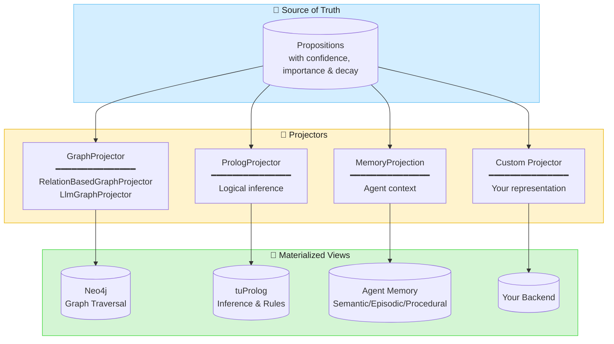

### Graph Projection

Two graph projectors are available:

| Projector | Strategy | Use Case |
|-----------|----------|----------|
| **RelationBasedGraphProjector** | Matches proposition text against known predicates | Fast, deterministic, no LLM cost |
| **LlmGraphProjector** | LLM classifies propositions into relationship types | Handles ambiguous or novel predicates |

Both use a consistent builder pattern with convenience methods for common configurations.

#### RelationBasedGraphProjector

Projects propositions to graph relationships by matching predicates from the schema and `Relations`:

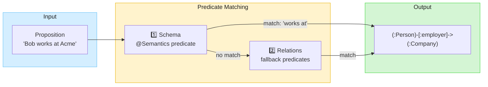

**Priority order:**

1. Schema relationships with `@Semantics(predicate="...")` → uses property name as relationship type
2. `Relations` predicates → derives relationship type via UPPER_SNAKE_CASE

```kotlin
// Schema-driven: uses property name "employer"
// "Bob works at Acme" → (bob)-[:employer]->(acme)

// Relations fallback: derives from predicate
val relations = Relations.empty().withProcedural("likes")
// "Alice likes jazz" → (alice)-[:LIKES]->(jazz)

val projector = RelationBasedGraphProjector.from(relations)
    .withLenientPolicy()
val results = projector.projectAll(propositions, schema)
```

#### LlmGraphProjector

Uses an LLM to classify propositions into relationship types. Useful when predicates are
ambiguous or when you want the LLM to infer relationships not explicitly stated:

```kotlin
// Kotlin
val projector = LlmGraphProjector(
    ai = ai,
    relations = relations,
    policy = LenientProjectionPolicy(),
    llmOptions = llmOptions,
)
```

```java
// Java — builder pattern
var projector = LlmGraphProjector
    .withLlm(projectionLlm)
    .withAi(ai)
    .withRelations(relations)
    .withLenientPolicy();
```

**Wither methods** (both projectors):

| Method | Description |
|--------|-------------|
| `withPolicy(policy)` | Set any `ProjectionPolicy` |
| `withLenientPolicy()` | `LenientProjectionPolicy` with default threshold (0.7) |
| `withLenientPolicy(threshold)` | `LenientProjectionPolicy` with custom threshold |
| `withDefaultPolicy()` | `DefaultProjectionPolicy` with default threshold (0.85) |
| `withDefaultPolicy(threshold)` | `DefaultProjectionPolicy` with custom threshold |

`LlmGraphProjector` also has `withRelations(relations)` and `withLlmOptions(llmOptions)`.

#### GraphProjectionService

`GraphProjectionService` bundles a `GraphProjector`, `GraphRelationshipPersister`, and
`DataDictionary` into a single facade for the common project-and-persist workflow:

```kotlin
// Kotlin
val service = GraphProjectionService(graphProjector, persister, schema)
val (projectionResults, persistenceResult) = service.projectAndPersist(propositions)
```

```java
// Java
var service = GraphProjectionService.create(graphProjector, persister, dataDictionary);
var result = service.projectAndPersist(propositions);
```

```java
// Spring configuration
@Bean
GraphProjectionService graphProjectionService(
        GraphProjector graphProjector,
        GraphRelationshipPersister persister,
        DataDictionary dataDictionary) {
    return GraphProjectionService.create(graphProjector, persister, dataDictionary);
}
```

### Prolog Projection (Experimental)

The Prolog projector converts propositions to Prolog facts for logical inference:

```
  +----------------+     +------------------+     +------------------+
  |  Propositions  | --> | GraphProjector   | --> | PrologProjector  |
  |                |     | (LLM classifies) |     | (converts to     |
  | "Alice knows   |     |                  |     |  Prolog syntax)  |
  |  Kubernetes"   |     | EXPERT_IN        |     |                  |
  +----------------+     +------------------+     +------------------+
                                                          |
                                                          v
                                                   +----------------+
                                                   |  tuProlog      |
                                                   |  Knowledge     |
                                                   |  Base          |
                                                   +----------------+
```

Facts project to Prolog predicates:

- `expert_in(Person, Technology)` - expertise relationships
- `friend_of(Person, Person)` - social connections
- `works_at(Person, Company)` - employment
- `reports_to(Person, Manager)` - hierarchy

#### Custom Inference Rules

Rules are loaded from `prolog/dice-rules.pl` on the classpath:

```prolog
% Transitive reporting chain
reports_to_chain(X, Y) :- reports_to(X, Y).
reports_to_chain(X, Y) :- reports_to(X, Z), reports_to_chain(Z, Y).

% Derived relationships
coworker(X, Y) :- works_at(X, Company), works_at(Y, Company), X \= Y.

% Expertise queries
can_consult(Person, Expert, Topic) :-
    friend_of(Person, Expert),
    expert_in(Expert, Topic).
```

### Agent Memory

The `Memory` class gives agents access to their stored memories (propositions) within a context.
It implements `LlmReference` — surfacing key memories directly in the LLM system prompt
and exposing a search tool for additional retrieval.

#### Why LlmReference, not just Tool?

Key memories need to be in the system prompt, not buried in tool metadata. When memories are
only in a tool description, LLMs treat them as instructions for *when to call the tool* — they
don't reason about the facts contained within. By implementing `LlmReference`:
- **`contribution()`** injects key memories into the system prompt as first-class facts
  the LLM can reason about directly
- **`tools()`** exposes the memory search tool for on-demand retrieval of additional memories
- The LLM sees key memories immediately and can call the tool for more when needed

This is a **two-tier retrieval strategy**:

1. **Eager** (via `contribution()`): Key memories are preloaded into the system prompt, making them
   immediately visible to the LLM as authoritative facts. Three eager modes are available:
   - `withEagerSearchAbout(text, limit)`: Preloads memories by vector similarity to arbitrary text (e.g., recent conversation content)
   - `withEagerTopicSearch(limit)`: Preloads memories by vector similarity to the `topic`
   - `withEagerQuery { ... }`: Preloads memories by structured query (e.g., top-N by confidence)
   - All modes can be combined — results are merged and deduplicated.
2. **On-demand**: The LLM calls the tool with search parameters to find specific memories
   when the eager set isn't sufficient. Tool results automatically deduplicate against
   eagerly loaded memories, so the LLM always receives new information.

This means the most important memories are always available (zero latency, in the prompt), while
the full memory store remains searchable on demand.

#### Search Parameters

The tool surface is deliberately minimal: one freeform `query` plus an optional `limit`.

- **`query`**: A natural-language description of what to recall (e.g. `{"query": "the user's hobbies"}`,
  `{"query": "where does the user live"}`, `{"query": "Stripe"}`). Memory runs a **hybrid** retrieval in
  three tiers over the same scoped propositions, unions the hits, and tags each line with the probe(s)
  that found it (`[vector]` / `[keyword]` / `[related]`):
  1. **vector** — similarity search; carries question-shaped queries.
  2. **keyword** — by **term overlap**, not whole-string substring: the query is tokenised (Unicode
     letters/digits, length ≥ 3, no stopword list) and candidates are scored by how many distinct
     query tokens they contain. A phrase query never substring-matches a proposition, but its salient
     token (a name, a rare term) does.
  3. **related** — entity expansion: *when the first two tiers come back thin*, Memory widens to other
     propositions that mention the **same entities** the direct hits do (via `PropositionQuery`'s entity
     filter — no external graph needed). This is "similar results around the retrieved nodes".
- **`limit`**: Maximum results (optional).
- **No parameters** or `{}`: Returns all memories ordered by confidence.

**Every returned line carries two compact annotations when available:**
- `— source: …` — provenance, supplied by an optional [`ProvenanceResolver`](src/main/kotlin/com/embabel/dice/agent/ProvenanceResolver.kt)
  wired via `withProvenance(...)`. Propositions are extracted from sources (emails, meetings, docs); the
  resolver turns a proposition's lineage into a readable descriptor (subject / title / name) so the LLM
  can cite where a fact came from straight from a recall — no separate citation tool. This is **not** a
  retrieval hook (it doesn't change what's returned, and it's not a tool parameter); it only annotates.
- `— entities: name (id); …` — the resolved entities the proposition mentions, giving the LLM durable
  handles to drill into (via a name lookup or a Cypher anchor) without re-searching.

There is no predicate / subject / object / type parameter surface — the agent asks in natural
language and, if the first query is unconvincing, simply asks again with different wording. The
empty-result message nudges it to do exactly that.

Fusion scoring (RRF) and graph-distance reranking are intentionally **not** implemented yet:
vector hits keep similarity order, then keyword hits by term overlap, then related hits by confidence.

#### Scoping

The context is baked in at construction time, ensuring the agent can only access memories within its
authorized context. The description dynamically reflects how many memories are available.

For finer-grained control, `narrowedBy` applies additional constraints to *every* query — eager loading,
description count, and all search modes. The LLM cannot escape these constraints.

```kotlin
// Only memories mentioning Alice
val memory = Memory.forContext(contextId)
    .withRepository(propositionRepository)
    .narrowedBy { it.withEntityId("alice-123") }

// Memories involving both Alice and Bob
val memory = Memory.forContext(contextId)
    .withRepository(propositionRepository)
    .narrowedBy { it.withAllEntities("alice", "bob") }

// Memories about Alice OR Bob, abstractions only
val memory = Memory.forContext(contextId)
    .withRepository(propositionRepository)
    .narrowedBy { it.withAnyEntity("alice", "bob").withMinLevel(1) }

// Only high-importance memories
val memory = Memory.forContext(contextId)
    .withRepository(propositionRepository)
    .narrowedBy { it.withMinImportance(0.7) }

// Only level-0 active propositions
val memory = Memory.forContext(contextId)
    .withRepository(propositionRepository)
    .narrowedBy { it.withMinLevel(0).withMaxLevel(0).withStatus(PropositionStatus.ACTIVE) }
```

```java
// Java — scoped to an entity
Memory memory = Memory.forContext("session-123")
    .withRepository(propositionRepository)
    .narrowedBy(query -> query.withEntityId("alice-123"));

// Java — scoped to multiple entities (AND)
Memory memory = Memory.forContext("session-123")
    .withRepository(propositionRepository)
    .narrowedBy(query -> query.withAllEntities("alice", "bob"));
```

`narrowedBy` composes with all eager modes — the eager searches and queries receive the
already-narrowed base, so they can only further restrict (ordering, limits), never widen the scope.

#### Usage

```kotlin
// Kotlin — eager search about recent conversation
val memory = Memory.forContext(contextId)
    .withRepository(propositionRepository)
    .withProjector(memoryProjector)
    .withEagerSearchAbout(recentConversationText, 10)

// Use as a reference — key memories go into the system prompt,
// the search tool is automatically added
ai.withReferences(memory).respond(...)
```

```java
// Java — eager search about recent conversation
var recentContext = new WindowingConversationFormatter(
        SimpleMessageFormatter.INSTANCE, 5, 0
).format(conversation);

var memory = Memory.forContext(user.currentContext())
        .withRepository(propositionRepository)
        .withProjector(memoryProjector)
        .withEagerSearchAbout(recentContext, 10);

// Use as a reference — contribution() adds key memories to the prompt,
// tools() provides the search tool
ai.withReferences(memory).respond(...);
```

`withEagerSearchAbout` is the recommended eager mode for chat agents — it uses the actual
conversation content as the search query, so the memories preloaded into the description
are always relevant to what the user is talking about right now.

For topic-focused agents, use `withEagerTopicSearch`:

```kotlin
// Kotlin — eager topic search (preloads top 5 memories matching the topic)
val memory = Memory.forContext(contextId)
    .withRepository(propositionRepository)
    .withTopic("classical music preferences")
    .withEagerTopicSearch(5)
```

All three eager modes can be combined — results are merged and deduplicated:

```kotlin
val memory = Memory.forContext(contextId)
    .withRepository(propositionRepository)
    .withTopic("classical music preferences")
    .withEagerSearchAbout(recentConversationText, 10)
    .withEagerTopicSearch(5)
    .withEagerQuery { it.orderedByEffectiveConfidence().withLimit(3) }
```

#### Configuration Options

| Option | Description | Default |
|--------|-------------|---------|
| `narrowedBy(UnaryOperator<PropositionQuery>)` | Narrows the scope of all queries (e.g., by entity, level, status). Applied before any tool-specific additions | none (unscoped) |
| `withProjector(MemoryProjector)` | Projector for classifying memories by knowledge type | `DefaultMemoryProjector.DEFAULT` (heuristic) |
| `withMinConfidence(Double)` | Minimum effective confidence threshold (0.0–1.0) | 0.5 |
| `withDefaultLimit(Int)` | Maximum results per search | 10 |
| `withTopic(String)` | Describes what these memories are about. Completes the form "memories about _topic_" | `"the user & context"` |
| `withUseWhen(String)` | Instruction to the LLM for when to use the memory tool | `"whenever you need to recall information about <topic>"` |
| `withEagerSearchAbout(String, Int)` | Preloads memories by vector similarity to the given text (e.g., recent conversation). Recommended for chat agents | none (disabled) |
| `withEagerTopicSearch(Int)` | Preloads memories by vector similarity to the `topic` into the system prompt. Tool calls auto-deduplicate against these | none (disabled) |
| `withEagerQuery(UnaryOperator<PropositionQuery>)` | Preloads key memories by structured query (e.g., top-N by confidence) into the system prompt | none (disabled) |

All search modes expose optional `level` and `type` parameters to the LLM, allowing it to filter
by abstraction level and knowledge type at query time. Both compose with `narrowedBy`.

#### Prompt Template

DICE ships a reusable Jinja template at `prompts/dice/thorough_memory.jinja` that instructs the
LLM how to use Memory correctly — prioritizing key memories from the system prompt, searching
thoroughly, and never fabricating information.

Include it in your persona or system prompt:

```jinja

```

The template covers:
- Using key memories (already in the prompt) before calling the tool
- Preferring semantic (`topic`) search over keyword search
- Never fabricating or guessing — saying "I don't know" when no information is found
- Searching thoroughly with multiple queries for broad questions
- Not embellishing beyond what memory returned

### Memory Projection

Memory projection classifies propositions into cognitive memory types for agent context.
The design separates **querying** (via `PropositionQuery`) from **classification** (via `MemoryProjector`).

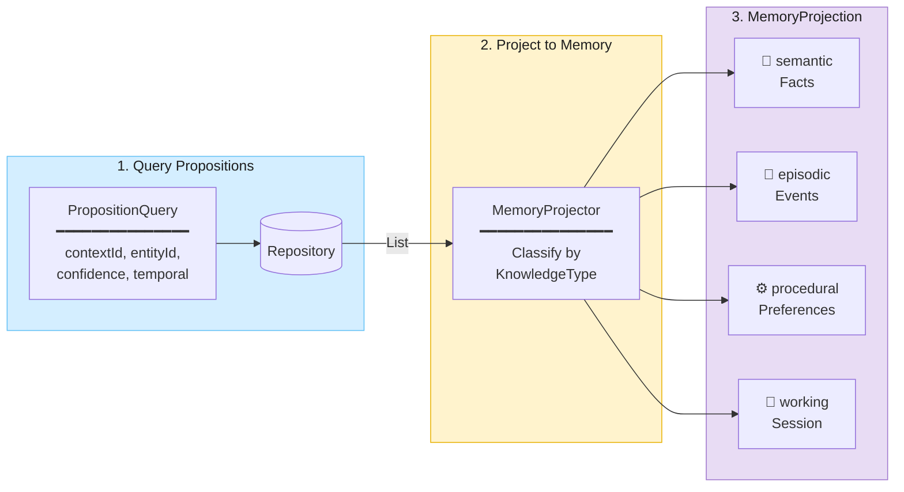

**Complete example:**

```kotlin
// 1. Query propositions (caller controls what to fetch)
val props = repository.query(
    (PropositionQuery forContextId sessionContext)
        .withEntityId("alice-123")
        .withMinEffectiveConfidence(0.5)
        .orderedByEffectiveConfidence()
        .withLimit(50)
)

// 2. Project into memory types
val projector = DefaultMemoryProjector.DEFAULT
val memory = projector.project(props)

// 3. Use classified propositions
memory.semantic   // factual knowledge
memory.episodic   // event-based memories
memory.procedural // preferences and rules
memory.working    // session context

// Access by type
val facts = memory[KnowledgeType.SEMANTIC]
```

**Classification sources:**

- **Relations predicates**: "likes" → PROCEDURAL, "works at" → SEMANTIC, "met" → EPISODIC
- **Heuristic fallback**: High decay → EPISODIC, High confidence + low decay → SEMANTIC

```kotlin
val relations = Relations.empty()
    .withProcedural("likes", "prefers", "enjoys")
    .withSemantic("works at", "is located in")
    .withEpisodic("met", "visited", "attended")

val classifier = RelationBasedKnowledgeTypeClassifier.from(relations)
val projector = DefaultMemoryProjector.create(classifier)
val memory = projector.project(propositions)
```

### Memory Maintenance

The `MemoryMaintenanceOrchestrator` provides a single entry point for memory maintenance —
consolidating, abstracting, retiring, and persisting — suitable for end-of-session or scheduled batch runs.

**Three-phase pipeline:**

1. **Consolidate** — Run `MemoryConsolidator` to promote/reinforce/merge/discard session propositions
   against existing long-term memories. Persists all changes.
2. **Abstract** — Run `PropositionAbstractor` on groups of related propositions (grouped by entity)
   to synthesize higher-level insights. Source propositions are marked `SUPERSEDED`.
3. **Retire expired** *(optional)* — Delete ACTIVE propositions whose effective confidence has
   decayed below a configurable threshold.

```kotlin
// End-of-session: consolidate + abstract + retire
val orchestrator = MemoryMaintenanceOrchestrator
    .withRepository(propositionRepository)
    .withConsolidator(DefaultMemoryConsolidator())
    .withAbstractor(LlmPropositionAbstractor.withLlm(llm).withAi(ai))
    .withRetireBelow(0.1)

val result = orchestrator.maintain(contextId, sessionPropositions)

// Scheduled maintenance: just abstract + retire (no session props)
val result = orchestrator.maintain(contextId)
```

```java
// Java
MaintenanceResult result = MemoryMaintenanceOrchestrator
    .withRepository(propositionRepository)
    .withConsolidator(new DefaultMemoryConsolidator())
    .withAbstractor(LlmPropositionAbstractor.withLlm(llm).withAi(ai))
    .withRetireBelow(0.1)
    .maintain(contextId, sessionPropositions);
```

#### Configuration Options

| Option | Description | Default |
|--------|-------------|---------|
| `withAbstractor(PropositionAbstractor)` | Abstractor for synthesizing higher-level insights | none (disabled) |
| `withAbstractionThreshold(Int)` | Minimum propositions per entity to trigger abstraction | 5 |
| `withAbstractionTargetCount(Int)` | How many abstractions to generate per group | 3 |
| `withRetireBelow(Double)` | Effective confidence threshold for retirement | none (disabled) |
| `withRetireDecayK(Double)` | Decay rate multiplier for retirement calculation | 2.0 |

### Proposition Operations

Operations transform groups of propositions into new, derived propositions. Unlike projections
(which convert to different representations), operations produce new propositions at higher
abstraction levels.

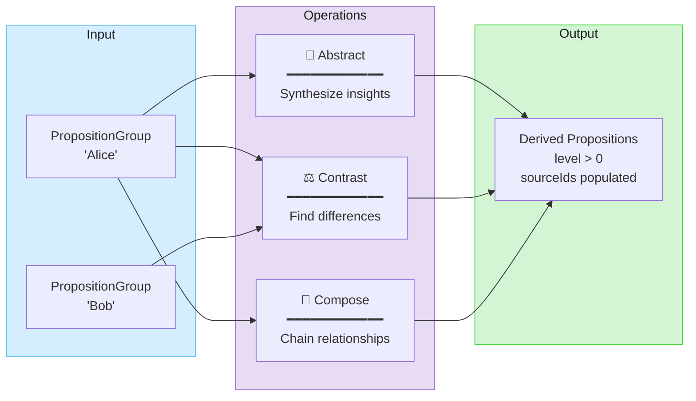

| Operation | Description | Example |
|-----------|-------------|---------|
| **Abstract** | Synthesize higher-level insights from a group | "likes jazz, blues, classical" → "enjoys music" |
| **Contrast** | Identify differences between groups | Alice vs Bob → "opposite meeting preferences" |
| **Compose** | Chain transitive relationships (via Prolog) | "A→B, B→C" → "A indirectly relates to C" |

#### Abstraction

Generate higher-level propositions that capture the essence of a group:

```kotlin
val abstractor = LlmPropositionAbstractor.withLlm(llm).withAi(ai)

// Group propositions with a label
val bobGroup = PropositionGroup("Bob", repository.findByEntity("bob-123"))

// Generate abstractions
val abstractions = abstractor.abstract(bobGroup, targetCount = 2)
// "Bob values thoroughness and clarity in work processes"
// "Bob prefers structured communication"
```

#### Contrast

Identify and articulate differences between two groups:

```kotlin
val contraster = LlmPropositionContraster.withLlm(llm).withAi(ai)

val aliceGroup = PropositionGroup("Alice", aliceProps)
val bobGroup = PropositionGroup("Bob", bobProps)

val differences = contraster.contrast(aliceGroup, bobGroup, targetCount = 3)
// "Alice prefers morning meetings while Bob prefers afternoons"
// "Alice and Bob have different language preferences (Python vs Java)"
```

#### Proposition Levels and Source Resolution

Derived propositions track their abstraction level and provenance:

```kotlin
data class Proposition(
    // ... other fields ...
    val confidence: ZeroToOne,       // How certain (0.0-1.0)
    val importance: ZeroToOne = 0.5, // How much it matters (0.0-1.0)
    val decay: ZeroToOne = 0.0,      // How quickly it becomes stale (0.0-1.0)
    val level: Int = 0,              // 0 = raw, 1+ = derived
    val sourceIds: List<String>,     // IDs of source propositions
)

// Query by abstraction level
val rawObservations = repository.findByMinLevel(0)
val abstractions = repository.findByMinLevel(1)
```

Navigate the abstraction hierarchy using source resolution:

```kotlin
// Get the source propositions that an abstraction was derived from
val sources = repository.findSources(abstraction)

// Find all abstractions that cite a given proposition as a source
val derivations = repository.findAbstractionsOf(propositionId)
```

### Oracle: Natural Language Q&A

The Oracle answers questions using LLM tool calling with Prolog reasoning:

| Tool              | Description                                    |
|-------------------|------------------------------------------------|
| `show_facts`      | Display sample facts with human-readable names |
| `query_prolog`    | Execute Prolog queries with variable bindings  |
| `check_fact`      | Verify if a specific fact is true              |
| `list_entities`   | Browse all known entities                      |
| `list_predicates` | Show available relationship types              |

## Package Structure

```
com.embabel.dice
├── agent/                    # Agent integration
│   └── Memory                # Tool for memory search
│
├── common/                   # Shared types
│   ├── SourceAnalysisContext # Context for all DICE operations
│   ├── ContentHasher         # fun interface for content hashing (dedup)
│   ├── Sha256ContentHasher   # Default SHA-256 implementation
│   ├── EntityResolver        # Entity disambiguation interface
│   ├── KnownEntity           # Pre-defined entity for hints
│   ├── Relation              # Predicate with KnowledgeType
│   ├── Relations             # Builder for relation collections
│   ├── KnowledgeType         # SEMANTIC, EPISODIC, PROCEDURAL, WORKING
│   └── resolver/             # Entity resolution implementations
│       ├── CandidateSearcher        # Interface for candidate search
│       ├── SearchResult             # Confident match + candidates
│       ├── CandidateBakeoff         # Interface for selecting best match
│       ├── LlmCandidateBakeoff      # LLM-based candidate selection
│       ├── EscalatingEntityResolver # Chains searchers with optional bakeoff
│       ├── InMemoryEntityResolver   # Session-level deduplication
│       ├── ChainedEntityResolver    # Chains multiple resolvers
│       ├── KnownEntityResolver      # Fast-path for pre-defined entities
│       └── searcher/                # Built-in searchers (cheapest-first)
│           ├── ByIdCandidateSearcher           # ID lookup
│           ├── ByExactNameCandidateSearcher    # Exact name match
│           ├── NormalizedNameCandidateSearcher # Normalized names
│           ├── PartialNameCandidateSearcher    # Partial name match
│           ├── FuzzyNameCandidateSearcher      # Levenshtein distance
│           ├── VectorCandidateSearcher         # Embedding similarity
│           ├── AgenticCandidateSearcher        # LLM-driven search
│           └── DefaultCandidateSearchers       # Factory for defaults
│
├── proposition/              # Core types (source of truth)
│   ├── Proposition           # Natural language fact with confidence/importance/decay
│   ├── EntityMention         # Entity reference within proposition
│   ├── PropositionQuery      # Composable query specification
│   ├── Projector<T>          # Generic projection interface
│   ├── PropositionRepository # Storage interface (query, findSources, findAbstractionsOf)
│   ├── revision/             # Proposition revision
│   │   ├── PropositionReviser
│   │   ├── LlmPropositionReviser
│   │   └── RevisionResult    # New, Merged, Reinforced, Contradicted, Generalized
│   └── extraction/
│       └── LlmPropositionExtractor
│
├── projection/               # Materialized views from propositions
│   ├── graph/                # Knowledge graph projection
│   │   ├── GraphProjector    # Interface for graph projection
│   │   ├── RelationBasedGraphProjector  # Predicate-based (no LLM)
│   │   ├── LlmGraphProjector # LLM-based classification (data class + builder)
│   │   ├── ProjectionPolicy  # Filter before projection
│   │   ├── GraphProjectionService       # Facade: project + persist in one call
│   │   ├── GraphRelationshipPersister   # Persistence interface
│   │   └── NamedEntityDataRepositoryGraphRelationshipPersister
│   │
│   ├── prolog/               # Prolog projection for inference
│   │   ├── PrologProjector
│   │   ├── PrologEngine      # tuProlog wrapper
│   │   └── PrologSchema
│   │
│   └── memory/               # Agent memory projection
│       ├── MemoryProjector              # Interface: project(propositions) -> MemoryProjection
│       ├── MemoryProjection             # Result: semantic, episodic, procedural, working
│       ├── KnowledgeTypeClassifier      # Interface for classification
│       ├── RelationBasedKnowledgeTypeClassifier
│       ├── HeuristicKnowledgeTypeClassifier
│       ├── DefaultMemoryProjector       # Default implementation
│       └── MemoryRetriever              # Similarity + entity + recency retrieval
│
├── query/oracle/             # Question answering
│   ├── Oracle
│   ├── ToolOracle
│   └── PrologTools
│
├── operations/               # Proposition transformations
│   ├── PropositionGroup      # Labeled collection of propositions
│   ├── abstraction/          # Higher-level synthesis
│   │   ├── PropositionAbstractor
│   │   └── LlmPropositionAbstractor
│   └── contrast/             # Difference identification
│       ├── PropositionContraster
│       └── LlmPropositionContraster
│
├── entity/                   # Entity extraction domain
│   ├── EntityExtractor       # Entity extraction interface
│   ├── LlmEntityExtractor    # LLM-based entity extraction
│   ├── EntityPipeline        # Entity extraction + resolution pipeline
│   ├── ChunkEntityResult     # Single chunk entity results
│   ├── EntityResults         # Multi-chunk entity results
│   └── EntityIncrementalAnalyzer  # Streaming entity extraction
│
├── pipeline/                 # Proposition pipeline orchestration
│   └── PropositionPipeline   # Full proposition extraction
│
├── incremental/              # Incremental/streaming infrastructure
│   ├── IncrementalAnalyzer<T,R>       # Interface for incremental analysis
│   ├── AbstractIncrementalAnalyzer    # Base implementation with windowing
│   ├── IncrementalSource<T>           # Source abstraction
│   ├── IncrementalSourceFormatter<T>  # Formats items to text
│   ├── ConversationSource             # Conversation as incremental source
│   ├── MessageFormatter               # Formats messages
│   ├── ChunkHistoryStore              # Tracks processing history
│   ├── WindowConfig                   # Window and trigger configuration
│   └── proposition/                   # Proposition-based incremental
│       └── PropositionIncrementalAnalyzer
│
├── text2graph/               # Legacy knowledge graph building
│   ├── KnowledgeGraphBuilder
│   ├── SourceAnalyzer
│   └── SourceAnalyzerEntityExtractor  # Adapter wrapping SourceAnalyzer
```

## REST API

DICE provides REST endpoints for extracting propositions and managing memory. All endpoints are scoped by `contextId`.

### Extraction Endpoints

#### Extract from Text

```bash
curl -X POST http://localhost:8080/api/v1/contexts/{contextId}/extract \
  -H "Content-Type: application/json" \
  -d '{
    "text": "I love Brahms and his symphonies are incredible",
    "sourceId": "conversation-123",
    "knownEntities": [
      {"id": "user-1", "name": "Alice", "type": "User", "role": "SUBJECT"}
    ]
  }'
```

Response:
```json
{
  "chunkId": "chunk-abc",
  "contextId": "user-session-123",
  "propositions": [
    {
      "id": "prop-xyz",
      "text": "User loves Brahms",
      "mentions": [{"name": "Brahms", "type": "Composer", "role": "OBJECT"}],
      "confidence": 0.95,
      "action": "CREATED"
    }
  ],
  "entities": {"created": ["composer-brahms"], "resolved": [], "failed": []},
  "revision": {"created": 1, "merged": 0, "reinforced": 0, "contradicted": 0, "generalized": 0}
}
```

#### Extract from File

Supports PDF, Word, Markdown, HTML, and other formats via Apache Tika:

```bash
curl -X POST http://localhost:8080/api/v1/contexts/{contextId}/extract/file \
  -F "file=@document.pdf" \
  -F "sourceId=doc-123"
```

Response:
```json
{
  "sourceId": "doc-123",
  "contextId": "user-session-123",
  "filename": "document.pdf",
  "chunksProcessed": 5,
  "totalPropositions": 12,
  "chunks": [
    {"chunkId": "chunk-1", "propositionCount": 3, "preview": "Introduction to classical music..."}
  ],
  "entities": {"created": ["composer-brahms"], "resolved": ["composer-wagner"], "failed": []},
  "revision": {"created": 10, "merged": 2, "reinforced": 0, "contradicted": 0, "generalized": 0}
}
```

### Memory Endpoints

#### List Propositions

```bash
# Get all propositions for context
curl http://localhost:8080/api/v1/contexts/{contextId}/memory

# Filter by status and confidence
curl "http://localhost:8080/api/v1/contexts/{contextId}/memory?status=ACTIVE&minConfidence=0.8&limit=50"
```

#### Get Proposition by ID

```bash
curl http://localhost:8080/api/v1/contexts/{contextId}/memory/{propositionId}
```

#### Create Proposition Directly

```bash
curl -X POST http://localhost:8080/api/v1/contexts/{contextId}/memory \
  -H "Content-Type: application/json" \
  -d '{
    "text": "User prefers morning meetings",
    "mentions": [
      {"name": "User", "type": "User", "role": "SUBJECT"}
    ],
    "confidence": 0.9,
    "reasoning": "Explicitly stated preference"
  }'
```

#### Delete Proposition

```bash
curl -X DELETE http://localhost:8080/api/v1/contexts/{contextId}/memory/{propositionId}
```

#### Search by Similarity

```bash
curl -X POST http://localhost:8080/api/v1/contexts/{contextId}/memory/search \
  -H "Content-Type: application/json" \
  -d '{
    "query": "music preferences",
    "topK": 10,
    "similarityThreshold": 0.7,
    "filters": {
      "status": ["ACTIVE"],
      "minConfidence": 0.5
    }
  }'
```

#### Get Propositions by Entity

```bash
curl http://localhost:8080/api/v1/contexts/{contextId}/memory/entity/{entityType}/{entityId}

# Example
curl http://localhost:8080/api/v1/contexts/user-123/memory/entity/Composer/composer-brahms
```

### Spring Boot Integration

Controllers auto-configure when required beans are present:

```kotlin
@Configuration
class DiceApiConfig {

    @Bean
    fun propositionRepository(embeddingService: EmbeddingService): PropositionRepository =
        InMemoryPropositionRepository(embeddingService)

    @Bean
    fun propositionPipeline(
        extractor: PropositionExtractor,
        reviser: PropositionReviser,
        repository: PropositionRepository,
    ): PropositionPipeline = PropositionPipeline
        .withExtractor(extractor)
        .withRevision(reviser, repository)

    @Bean
    fun entityResolver(): EntityResolver = AlwaysCreateEntityResolver

    @Bean
    fun schema(): DataDictionary = DataDictionary.fromClasses(
        "ecommerce",
        Customer::class.java,
        Product::class.java,
    )
}
```

- `MemoryController` loads when `PropositionRepository` is available
- `PropositionPipelineController` loads when `PropositionPipeline` is available (via `@ConditionalOnBean`)

### Graph-Backed Storage (`dice-storage`)

`InMemoryPropositionRepository` is for tests and demos. For persistence, the **`dice-storage`** module
provides a graph-backed (Neo4j via [Drivine](https://github.com/drivine/drivine4j))
`PropositionRepository` — a drop-in for the in-memory one — together with a graph `ChunkHistoryStore`
and a `DecayManager`.

Add the autoconfigure dependency and flip one property — no manual wiring:

```xml
<dependency>
    <groupId>com.embabel.dice</groupId>
    <artifactId>dice-storage-autoconfigure</artifactId>
    <version>${dice.version}</version>
</dependency>
```

```yaml
embabel:
  dice:
    store:
      type: graph          # 'graph' (Neo4j/Drivine) or 'in-memory' (default)
```

With `type: graph`, the autoconfiguration registers `DrivinePropositionRepository` (and the
chunk-history store + a scheduled decay sweep) and provisions the Neo4j schema (vector + range
indexes, uniqueness constraints). Any `PropositionRepository` bean you define yourself still wins
(`@ConditionalOnMissingBean`), so call sites are unchanged.

Everything is pushed into the database rather than scanned in memory:

| Concern | How |
|---------|-----|
| **Propositions + mentions** | `:Proposition` / `:Mention` nodes; every `PropositionQuery` filter, ordering, and limit (incl. entity filters) pushes into Cypher |
| **Vector search** | Neo4j vector index over the proposition embedding (`findSimilar*`, entity-filtered vector, clustering in one statement) |
| **Metadata** | flat `metadata.<key>` node properties (queryable, not an opaque blob) |
| **Provenance** | `(:Proposition)-[:DERIVED_FROM]->(:Source)` with **shared, deduplicated** source nodes — reverse-traversable ("which propositions came from this source?") |
| **Decay** | `effectiveConfidence` materialised per node (seeded on save, refreshed by a scheduled sweep) so confidence ranking/filtering pushes into the DB; `DecayManager` applies lifecycle transitions (ACTIVE→STALE) |
| **Chunk history** | `:ProcessedChunk` nodes for incremental-analysis dedup |

> Requires a Drivine-supported graph database (Neo4j, FalkorDB, or Memgraph). See
> `dice-storage/HANDOFF.md` for architecture and `dice-storage/INTEGRATE-INTO-ASSISTANT.md` for a
> migration walkthrough.

### API Key Security

DICE provides API key authentication for the REST endpoints. Enable it via configuration:

#### Quick Start

```yaml
# application.yml
dice:
  security:
    api-key:
      enabled: true
      keys:
        - sk-your-secret-key-here
        - sk-another-key-for-different-client
```

Then include the API key in requests:

```bash
curl -H "X-API-Key: sk-your-secret-key-here" \
  http://localhost:8080/api/v1/contexts/user-123/memory
```

#### Configuration Options

```yaml
dice:
  security:
    api-key:
      enabled: true                    # Enable API key auth (default: false)
      keys:                            # List of valid API keys
        - sk-key-1
        - sk-key-2
      header-name: X-API-Key           # Header name (default: X-API-Key)
      path-patterns:                   # Paths to protect (default: /api/v1/**)
        - /api/v1/**
```

#### Custom API Key Authenticator

For production, implement your own `ApiKeyAuthenticator` to validate keys against a database or secrets manager:

```kotlin
@Component
class DatabaseApiKeyAuthenticator(
    private val apiKeyRepository: ApiKeyRepository,
) : ApiKeyAuthenticator {

    override fun authenticate(apiKey: String): AuthResult {
        val keyEntity = apiKeyRepository.findByKey(apiKey)
            ?: return AuthResult.Unauthorized("Invalid API key")

        if (keyEntity.isExpired()) {
            return AuthResult.Unauthorized("API key expired")
        }

        return AuthResult.Authorized(
            principal = keyEntity.clientId,
            metadata = mapOf("scopes" to keyEntity.scopes),
        )
    }
}
```

When you provide your own `ApiKeyAuthenticator` bean, it takes precedence over the in-memory implementation.

#### Spring Security Integration

For more control (e.g., combining with other auth methods), integrate with Spring Security directly:

```kotlin
@Configuration
@EnableWebSecurity
class SecurityConfig {

    @Bean
    fun apiKeyAuthenticator(): ApiKeyAuthenticator =
        InMemoryApiKeyAuthenticator.withKey("sk-your-secret-key")

    @Bean
    fun securityFilterChain(
        http: HttpSecurity,
        authenticator: ApiKeyAuthenticator,
    ): SecurityFilterChain {
        val apiKeyFilter = ApiKeyAuthenticationFilter(
            authenticator = authenticator,
            pathPatterns = listOf("/api/v1/**"),
        )

        return http
            .csrf { it.disable() }
            .sessionManagement { it.sessionCreationPolicy(SessionCreationPolicy.STATELESS) }
            .authorizeHttpRequests { auth ->
                auth.requestMatchers("/api/v1/**").authenticated()
                auth.requestMatchers("/actuator/health").permitAll()
                auth.anyRequest().permitAll()
            }
            .addFilterBefore(apiKeyFilter, UsernamePasswordAuthenticationFilter::class.java)
            .build()
    }
}
```

**Key points:**
- Disable CSRF for stateless API
- Use `STATELESS` session management
- Add the `ApiKeyAuthenticationFilter` before Spring's `UsernamePasswordAuthenticationFilter`
- Configure path patterns to match your API routes

#### Disabling OAuth/Form Login

If your application has OAuth or form login configured elsewhere, exclude the DICE endpoints:

```kotlin
@Configuration
@EnableWebSecurity
class SecurityConfig {

    @Bean
    fun securityFilterChain(http: HttpSecurity): SecurityFilterChain {
        return http
            // API endpoints use API key auth
            .securityMatcher("/api/v1/**")
            .csrf { it.disable() }
            .sessionManagement { it.sessionCreationPolicy(SessionCreationPolicy.STATELESS) }
            .authorizeHttpRequests { it.anyRequest().authenticated() }
            .addFilterBefore(apiKeyFilter(), UsernamePasswordAuthenticationFilter::class.java)
            // Disable OAuth for these endpoints
            .oauth2Login { it.disable() }
            .formLogin { it.disable() }
            .build()
    }
}
```

Or use multiple `SecurityFilterChain` beans with different matchers:

```kotlin
@Bean
@Order(1)
fun apiSecurityFilterChain(http: HttpSecurity): SecurityFilterChain {
    return http
        .securityMatcher("/api/v1/**")
        // API key auth config...
        .build()
}

@Bean
@Order(2)
fun webSecurityFilterChain(http: HttpSecurity): SecurityFilterChain {
    return http
        .securityMatcher("/**")
        // OAuth/form login config for web UI...
        .build()
}
```

## Installation

Add to your `pom.xml`:

```xml

<dependency>
    <groupId>com.embabel</groupId>
    <artifactId>dice</artifactId>
    <version>0.1.0-SNAPSHOT</version>
</dependency>
```

## Technology Stack

- **tuProlog (2p-kt)**: Pure Kotlin Prolog engine for inference
- **Spring Framework**: Dependency injection and web support (optional)
- **Embabel Agent**: AI/LLM integration framework
- **Kotlin**: Primary language

## References

### DICE: Domain-Integrated Context Engineering

Johnson, R. (2025). *Context Engineering Needs Domain Understanding*. Medium.
https://medium.com/@springrod/context-engineering-needs-domain-understanding-b4387e8e4bf8

### GUM: General User Models

Shaikh, O., Sapkota, S., Rizvi, S., Horvitz, E., Park, J.S., Yang, D., & Bernstein, M.S. (2025). *Creating General User
Models from Computer Use*. arXiv:2505.10831.
https://arxiv.org/abs/2505.10831

The proposition-based architecture is inspired by GUM's approach to building unified user models through
confidence-weighted propositions. GUM's four-module pipeline (Propose, Retrieve, Revise, Audit) demonstrates 76%
accuracy overall and 100% for high-confidence propositions.

```
  GUM Pipeline                    DICE
  ────────────                    ────
  Propose     ─────────────────►  PropositionExtractor
  Retrieve    ─────────────────►  PropositionRepository.findSimilar()
  Revise      ─────────────────►  PropositionReviser
  Audit       ─────────────────►  ProjectionPolicy
```

## License

Apache License 2.0
