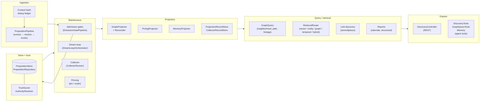
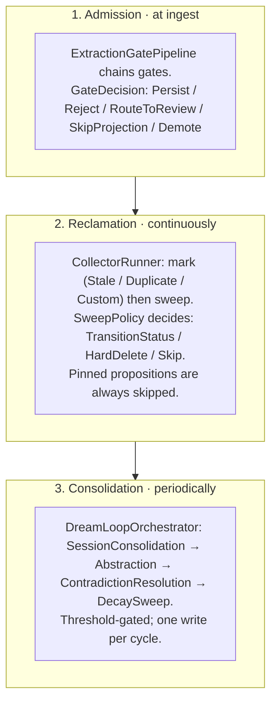
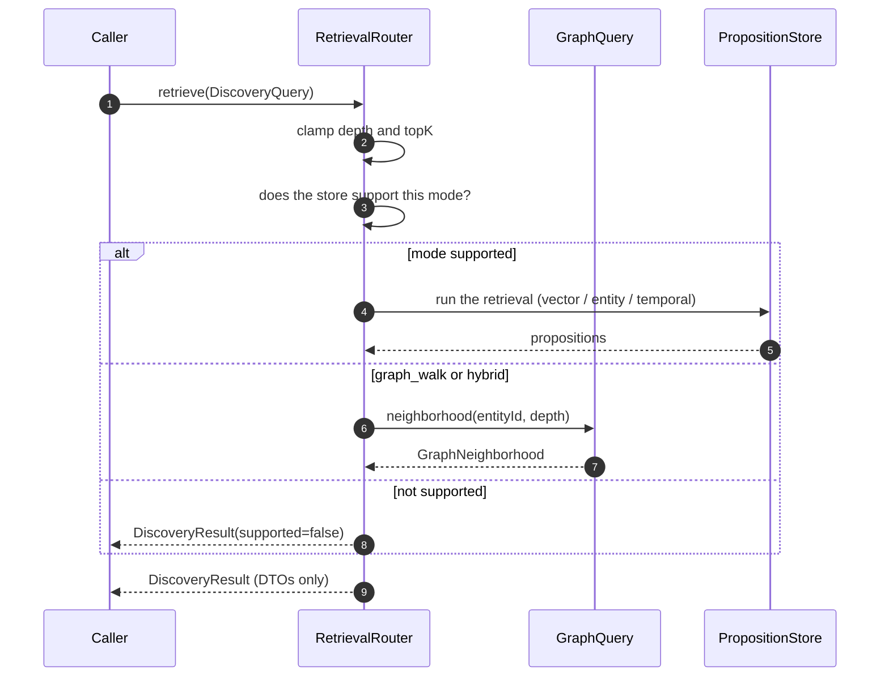
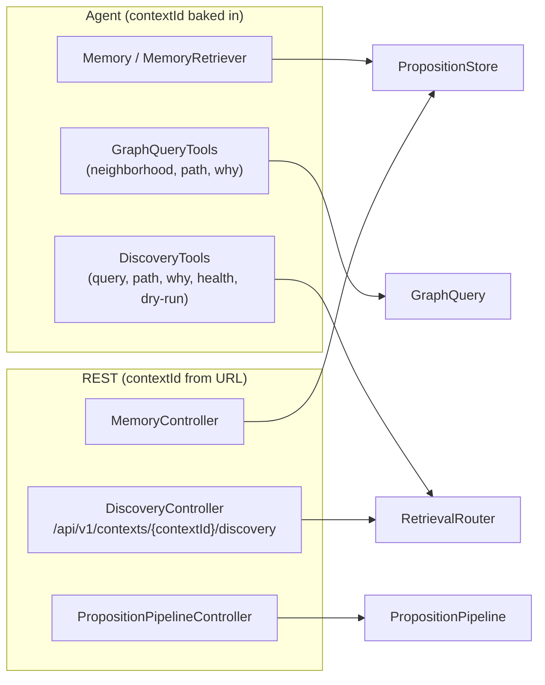
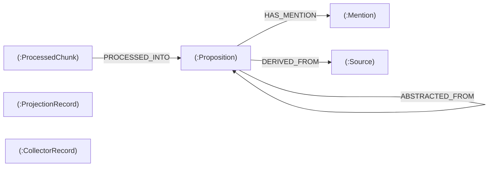

# DICE architecture overview

DICE is a proposition-first knowledge substrate: it turns raw text into confidence-weighted natural
language statements (propositions), keeps them healthy over time, and projects them into whatever
representation a task needs — a Neo4j graph, a Prolog fact base, vector embeddings, or agent
working memory. Propositions are the single system of record. Everything else derives from them.

## System-level map

The subsystems form a left-to-right pipeline from ingestion through maintenance to query. Each box
is a distinct subsystem with its own design note.

## Subsystem by subsystem

### Ingestion

The `dice-ingestion` module's dedup ledger claims a content hash before any extraction runs,
so two concurrent ingests of the same artifact never both proceed. Once through the ledger,
`PropositionPipeline` runs in two stages: a concurrent extraction stage (fan-out to the LLM,
order preserved) followed by a serial entity-resolution stage (one shared cross-chunk resolver).
The pipeline writes nothing — it hands an unsaved result back to the caller, which decides when
and where to persist. See [extraction-pipeline](extraction-pipeline.md).

### Store and trust/authority

`PropositionStore` is the base port: CRUD plus a composable `PropositionQuery`. `PropositionRepository`
extends it with four opt-in capability fragments a backend declares only when it genuinely supports
them:

| Fragment | What it adds |
|---|---|
| `VectorSearchCapable` | similarity search and clustering |
| `GraphTraversalCapable` | proposition abstraction-hierarchy traversal |
| `TemporalQueryCapable` | bitemporal valid/observed window queries |
| `GraphQueryCapable` | native neighbourhood, path, and lineage queries; `honorsAuthorityFilter` opt-in |

`TrustScorer` and `AuthorityResolver` are advisory — they score and rank, never delete or hide.
`AuthorityWeightedTrustScorer` is the production scorer; the default is neutral (everything trusted
equally). See [proposition-lifecycle](proposition-lifecycle.md) and [durable-storage](durable-storage.md).

### Maintenance

Three seams keep the store healthy at three different moments:

Pinning (`pin(id)` / `unpin(id)`) is a cross-cutting immunity: a pinned proposition is skipped by
the collector's sweep policy, not auto-demoted on contradiction, and excluded from the dream-loop's
contradiction-resolution pass. See [knowledge-hygiene](knowledge-hygiene.md),
[reclamation-and-collector](reclamation-and-collector.md), and
[consolidation-and-dream-loop](consolidation-and-dream-loop.md).

### Projection

`GraphProjector` turns propositions into graph edges, running each through a `Reconciler` that
returns `CreateNew`, `Adopt`, or `Align`. Every outcome — including skips and failures — is recorded
as a `ProjectionRecord`. When a proposition reaches a terminal status (superseded, contradicted,
stale), a listener cascades that to `STALE` on every associated `ProjectionRecord`. `PrologProjector`
and `MemoryProjector` project into the other backends.

Durable lineage is backed by `DrivineProjectionRecordStore` and `DrivineCollectorRecordStore` (in
`dice-storage`), which persist `(:ProjectionRecord)` and `(:CollectorRecord)` nodes in Neo4j so
audit trails survive a restart. See [graph-projection](graph-projection.md).

### Query / retrieval / discovery

`GraphQuery` is the portable graph facade — it answers neighbourhood, path, and lineage questions by
walking propositions over any store, routing to a native `GraphQueryCapable` backend when available.
`RetrievalRouter` is the single multi-modal entry point: it checks whether the backing store
supports the requested mode (VECTOR / ENTITY / GRAPH_WALK / TEMPORAL / HYBRID) and returns an
empty `supported=false` result rather than falling back to a scan when the mode isn't available.

See [retrieval-and-discovery](retrieval-and-discovery.md).

### Expose: agent tools and REST

Agent tools and REST share the same underlying routers and stores. The contextId is structurally
isolated — agent tools bake it in at construction, REST takes it from the URL path only. Neither
surface accepts a context override in the request body.

## Events

`EventEmittingPropositionRepository` and `EventEmittingProjector` are decorators that publish
`DiceEvent`s synchronously on saves and projections. The collector emits `PropositionStatusChanged`
per transition — identical to any other status change — so downstream consumers can't tell whether
a transition came from the collector, the reviser, or the dream loop. See [events](events.md).

## Neo4j graph schema

The durable Neo4j backend (`dice-storage`) holds these node labels and key relationships:

Uniqueness constraints on `(Proposition.contextId, Proposition.text)` guard dedup. A cosine vector
index on `Proposition.embedding` powers similarity search. Range indexes on `contextId`, `status`,
`effectiveConfidence`, and `Mention.resolvedId` push filters to the database. `ProjectionRecord`
and `CollectorRecord` MERGE on their natural keys so replayed writes are idempotent.

## Where to look first for each concern

| Concern | Where to start |
|---|---|
| Extraction + concurrency | `dice/pipeline`, `PropositionPipeline` |
| Proposition model and fields | `dice/proposition/Proposition.kt` |
| Store SPI and capability fragments | `dice/proposition/PropositionRepository.kt`, `GraphQueryCapable.kt` |
| Trust and authority scoring | `dice/spi/TrustScorer.kt`, `AuthorityResolver.kt` |
| Admission gates | `dice/proposition/gate/` |
| Pinning | `PropositionStore.pin/unpin`, `StatusTransitionSweepPolicy` |
| Dream-loop consolidation | `dice/projection/memory/DreamLoopOrchestrator.kt` |
| Mark-and-sweep reclamation | `dice/projection/memory/CollectorRunner.kt`, `dice/spi/SweepPolicy.kt` |
| Graph projection + lineage | `dice/projection/graph/`, `dice/projection/lineage/` |
| Durable Neo4j backend | `dice-storage/` |
| Retrieval router | `dice/query/discovery/RetrievalRouter.kt` |
| Graph query facade | `dice/query/graph/GraphQuery.kt` |
| Agent tools | `dice/agent/DiscoveryTools.kt`, `GraphQueryTools.kt` |
| REST surface | `dice/web/rest/DiscoveryController.kt` |
| Events | `dice/common/` (event types), `EventEmittingPropositionRepository` |
| Spring Boot wiring | `dice-storage-autoconfigure/DiceStorageAutoConfiguration.kt` |
