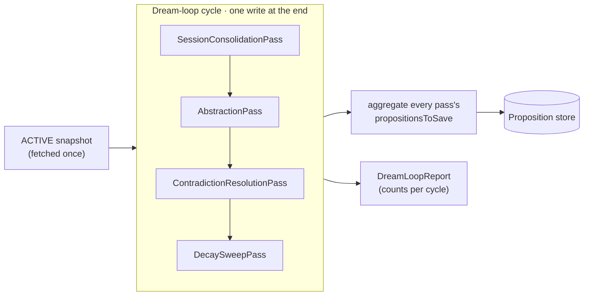
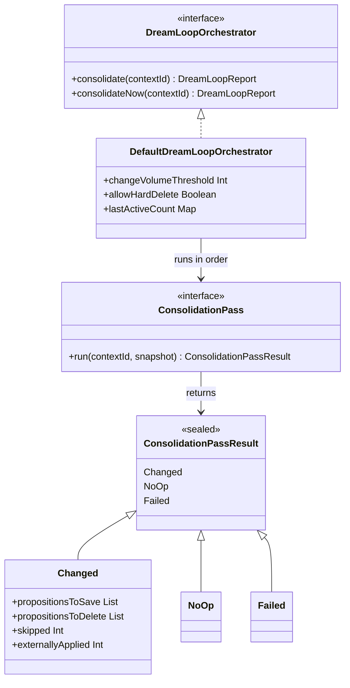
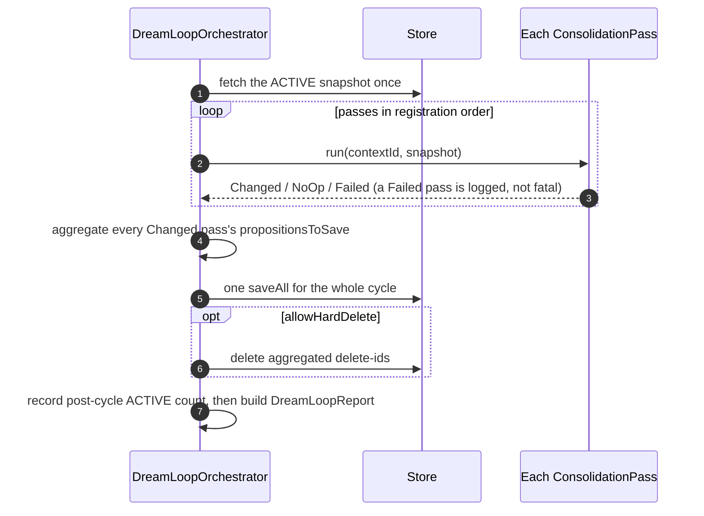
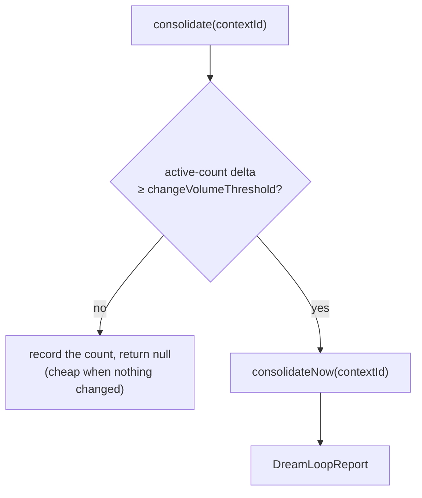

# Consolidation and the dream loop: passes, composition, and the cycle

Admission and reclamation keep bad data out and reclaim what's no longer useful, but they don't make
good data *better*. That's consolidation's job: fold a session's raw facts into long-term memory,
abstract clusters of related facts into higher-level ones, resolve lingering contradictions, and
retire what has decayed. The [knowledge-hygiene](knowledge-hygiene.md) note explains *why*
consolidation is a separate intervention; this note is about *how* it's built — the pass abstraction,
the four passes that ship, and how the dream loop composes them into one repeatable cycle.

## Pass SPI and result types

## The pass abstraction

Every consolidation step is a `ConsolidationPass`: it takes the context's snapshot of propositions,
decides what should change, and returns a `ConsolidationPassResult` — **it never writes anything
itself**. That purity contract is the whole design. The orchestrator fetches the snapshot once, runs
each pass over it, and applies the accumulated changes in a single write per cycle, so passes stay
small, independently testable, and reorderable.

A result is one of three things, sealed so the orchestrator handles every case:

- **`Changed`** — propositions to upsert (`propositionsToSave`), ids to hard-delete
  (`propositionsToDelete`, honored only when the orchestrator opts in), a `skipped` count, and an
  `externallyApplied` count for transitions a pass already wrote through its own machinery.
- **`NoOp`** — nothing to do; the snapshot is already settled for this pass. Returning `NoOp` rather
  than an empty `Changed` is how the loop detects convergence.
- **`Failed`** — the pass threw; the orchestrator records it and continues with the remaining passes
  rather than aborting the cycle.

Passes must be **idempotent**: running one twice over an unchanged snapshot must yield `NoOp`, because
the loop runs passes repeatedly until the snapshot settles. A pass that always reports `Changed` would
loop forever.

## The four passes that ship

**`SessionConsolidationPass`** folds a session's propositions into long-term memory by delegating to a
`MemoryConsolidator` — promoting, reinforcing, or merging against the existing ACTIVE set. The session
is supplied at construction; the snapshot it runs against is the long-term set, not the session.

**`AbstractionPass`** groups level-0 ACTIVE propositions by resolved entity, hands each group above a
size threshold to a `PropositionAbstractor`, and marks the consumed sources `SUPERSEDED` — this is
what drives **supersession** in the lifecycle. Two guards keep it from inflating forever: an
*idempotency guard* skips a group already covered by a higher-level proposition
(`sourceIds.containsAll(memberIds)`), and a `maxLevel` cap drops any abstraction above the ceiling.

**`ContradictionResolutionPass`** asks a `PropositionReviser` to classify each ACTIVE proposition
against its entity-overlapping peers; for each pair the reviser calls `CONTRADICTORY`, the lower
effective confidence loses and is transitioned to `CONTRADICTED` — this drives **contradiction**. It
prunes candidates to entity-overlapping peers (bounding the classify fan-out) and resolves each
unordered pair once, so a symmetric reviser can't retire both members and leave no survivor.

**`DecaySweepPass`** delegates to the mark-and-sweep collector (see
[reclamation-and-collector](reclamation-and-collector.md)) to move decayed propositions toward
`STALE`. It is **report-only**: the collector writes the transitions itself, so the pass returns empty
save/delete lists and reports the count via `externallyApplied`, avoiding a double write.

## How a cycle composes them

`consolidateNow` is the cycle. It does six things in order, and the shape is deliberate:

Aggregating into a single write is the reason passes don't write themselves: one cycle, one
`saveAll`, regardless of how many passes contributed. Hard deletes are off by default — a pass can
always *express* a delete intent without risking data loss, and only an orchestrator built with
`allowHardDelete` acts on it.

The `DreamLoopReport` rolls up what happened: `totalExamined` (snapshot size), `totalNewPropositions`
(propositions whose id wasn't in the snapshot — genuinely new, like a fresh abstraction), and
`totalTransitioned` (re-saved snapshot members plus deletes plus each pass's `externallyApplied`).

## Triggering: threshold-gated vs. unconditional

There are two ways in. `consolidateNow` always runs a cycle. `consolidate` is the cheap,
run-it-often entry point: it only does the expensive work when enough has accumulated since the last
cycle.

The trigger tracks the ACTIVE count per context (`lastActiveCount`) and fires when the delta reaches
`changeVolumeThreshold`. Both entry points hold a **per-context lock** for the whole gate-plus-cycle,
so two triggers for the same context can't both pass the gate on the same stale count and run
overlapping cycles. Different contexts lock independently and still run in parallel; the lock lives on
the orchestrator instance, so a single shared instance is the unit of serialization.

## Where this sits relative to revision

Contradiction shows up in two places, and they're not the same moment. At **ingest**, the
`PropositionReviser` (see [proposition-lifecycle](proposition-lifecycle.md)) classifies a *newly
arriving* proposition against what's stored and demotes the loser immediately. The
`ContradictionResolutionPass` runs later, during a quiet consolidation cycle, sweeping for
contradictions *among already-stored* propositions that no single ingest caught. Same lifecycle
transition (`CONTRADICTED`), different trigger — one reactive, one background. Likewise, abstraction
is where most **supersession** happens, long after the source facts were ingested.

## Configurable behavior

The pass list, the consolidator and abstractor and reviser each pass delegates to, the
`changeVolumeThreshold`, and whether hard deletes are allowed are all configurable through the
orchestrator's copy-builders. What ships is conservative — soft transitions over deletes, consolidate
only past a threshold — so the safe behavior is the default and a deployment opts into anything more
aggressive.
