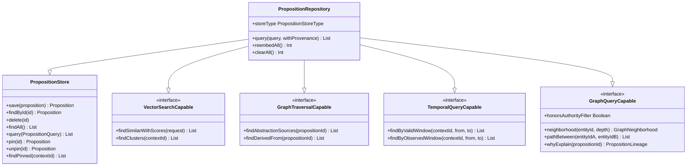
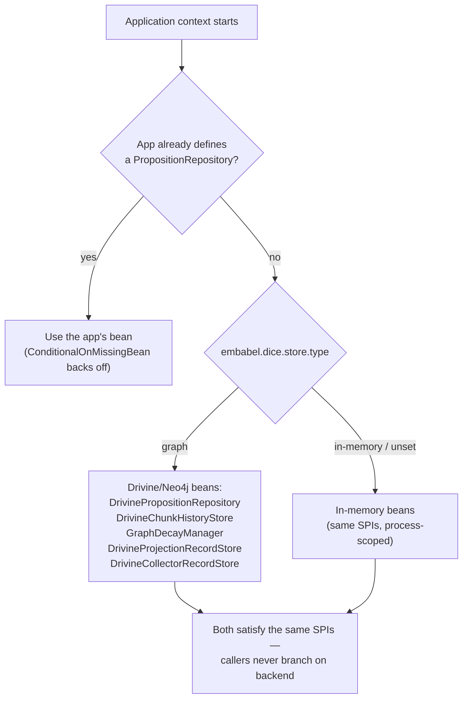
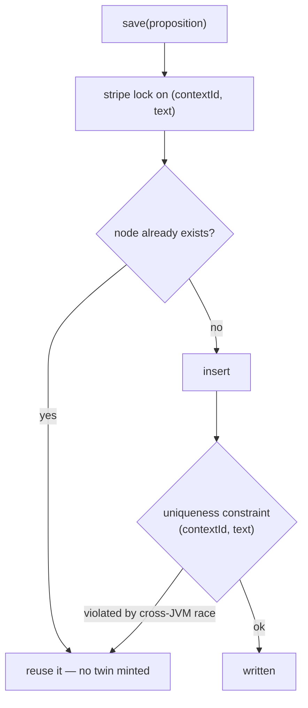
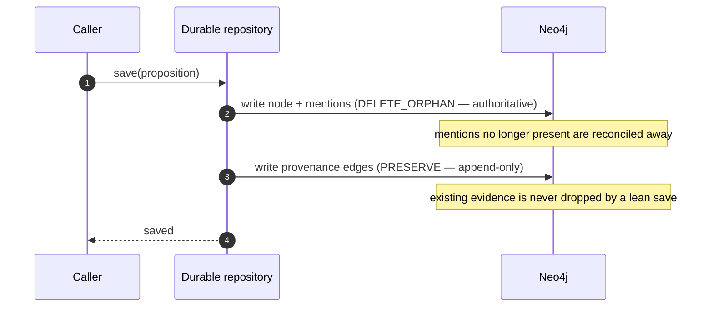
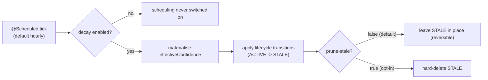

# Durable storage: backends, dedup, and the decay tick

Propositions are the system of record, so where and how they're persisted has to be both pluggable
and hard to corrupt. The core never talks to a database — it talks to the `PropositionStore` family
of SPIs (see [graph-projection](graph-projection.md) for the port idea). This note is about what
happens behind that port: how a deployment picks a backend, how the durable Neo4j backend keeps
duplicates and provenance honest, and how confidence decay is kept fast and current. The mechanics
(class names, Cypher, the KSP DSL) live in `dice-storage`'s own guide; this note is the *why*.

## Store SPI family

The store layer is a family of composable interfaces. `PropositionStore` is the base — CRUD plus a
composable query. `PropositionRepository` extends it with optional capability fragments a backend
declares only when it genuinely supports them.

`DrivinePropositionRepository` (in `dice-storage`) implements all four capability fragments.
`InMemoryPropositionRepository` (in `dice`) implements the base store plus vector search, but not
graph traversal or temporal queries, because it can't genuinely back them. The backend declares what
it supports; callers degrade rather than break when a capability is absent.

## Choosing a backend without choosing it

A deployment selects its store with one property — `embabel.dice.store.type=graph` for Drivine/Neo4j,
anything else (the default) for in-memory. The wiring lives entirely in autoconfiguration, and two
rules make it predictable. Every *store* bean is `@ConditionalOnMissingBean`, so an application that
defines its own store always wins — the autoconfig only fills gaps. And the graph beans are declared
*before* their in-memory counterparts, so the `type` flip resolves cleanly by registration order
rather than by a tangle of mutually-exclusive conditions. (The schema-catalog beans below are the one
exception: they're gated only by the backend property, so they're applied whenever the graph backend
is active rather than backing off to a competing bean.)

The point is that the rest of DICE is written against the SPIs and never learns which backend won.
The graph backend even declares only the capabilities it can genuinely honour (vector search, graph
traversal, temporal queries, graph query); a leaner backend simply doesn't claim them, and callers
degrade rather than break — the same "declare only what you really support" stance the store layer
takes everywhere.

## Dedup as defense in depth

Concurrent chunk extraction is the normal case, and two chunks can independently mint the *same*
fact — identical `(contextId, text)`. Letting both land would inflate confidence and double-count
evidence, so the durable backend guards against it in two layers rather than trusting either alone.

The first layer is an application-level **stripe-locked find-then-insert**: a `save()` takes a lock
keyed on the content, checks for an existing node, and reuses it instead of inserting a twin. That
catches the common case cheaply within one instance. The second layer is a Neo4j **uniqueness
constraint** on `(contextId, text)` — a database-enforced backstop for the case the application lock
can't see, two writers in *different* JVMs racing the same fact. When that constraint fires, `save()`
catches the violation and falls back to reusing the existing node.

Two layers because each covers the other's blind spot: the lock is fast but only sees one instance,
the constraint is global but only fires after the fact. Together they make "the same fact, minted
twice" converge to one node no matter how the writes interleave.

## Two-phase save: authoritative facts, append-only evidence

A proposition's node and its entity mentions are *authoritative* — a save reflects the current truth,
so stale mentions should be reconciled away. Its provenance edges are *evidence* — the trail of where
the fact came from, which should accumulate, never silently shrink because a later lean save didn't
mention it. Those are opposite write semantics, so the save is split in two.

The consequence is that a routine save can't accidentally erase the evidence behind a fact. Replacing
provenance is therefore a *deliberate* act through explicit set/clear provenance calls — never a side
effect of an ordinary update.

## Materialised effective confidence

Confidence decays continuously from the moment a fact's content last changed, so the value you rank
and filter by — `effectiveConfidence()` — is a function of time, not a stored constant (see
[proposition-lifecycle](proposition-lifecycle.md)). Recomputing it per row on every query would be
slow and would push decay math into the database. Instead the graph keeps a **materialised**
`effectiveConfidence` column that the decay tick refreshes, and queries with the default decay
parameters push their threshold straight onto that column — fast, index-backed, all in the DB.

The honest part is the fallback: a query asking for a *non-default* decay rate or an `asOf` in the
past can't trust the materialised column, so it pulls a candidate set from the DB and filters in
memory at the requested parameters. The fast path serves the overwhelmingly common case; the slow
path keeps the uncommon one correct rather than quietly wrong.

## Schema as idempotent declarations

Indexes and constraints aren't created by an imperative migration runner. They're declared as
`SchemaCatalog` beans — uniqueness constraints (the dedup backstop above, plus natural keys for the
lineage records), range indexes on the columns queries actually filter by, and a vector index on the
proposition embedding sized to the embedding model's dimension. Drivine applies them idempotently on
startup, so the same declarations are safe to re-run every boot.

Declaring schema as data rather than steps means startup converges to the desired shape no matter the
prior state, and the natural-key uniqueness constraints are what let the lineage stores `MERGE` their
records — a replayed projection or collector record updates in place instead of duplicating. One
caveat worth stating plainly: changing the embedding model to one with a different vector dimension
requires dropping and recreating the vector index — re-embedding alone won't resize it.

## The decay tick

Decay only matters if something advances it. A scheduled tick materialises the cached confidence
column and then applies lifecycle transitions (ACTIVE→STALE and, if opted in, pruning). It's split
into its own configuration so `@EnableScheduling` is switched on *only* when decay is enabled, and it
resolves the decay manager lazily so it works regardless of which backend registered one.

The defaults are deliberately gentle — tick hourly, transition to a reversible `STALE`, and *don't*
prune unless a deployment opts in — so leaving DICE running doesn't quietly delete knowledge. The
tick interval, the decay-rate multiplier, and whether stale facts are pruned are all properties.

## Configurable behavior

Backend choice, every store bean, the schema catalogs, and the decay schedule are all overridable —
define your own bean and the autoconfig backs off. What ships is safe by default: in-memory unless
asked otherwise, dedup enforced in two independent layers, provenance never dropped by a routine
save, and decay that ages knowledge gently rather than deleting it.
