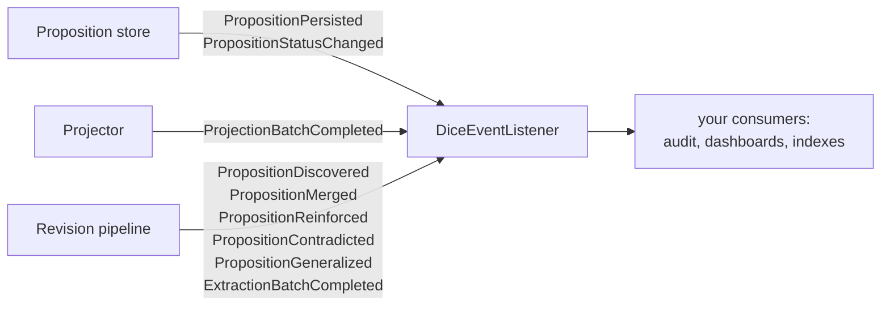
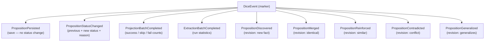

# Events

DICE emits domain events as it works — a fact was persisted, a proposition changed status, a batch
finished — so other parts of a system can react without DICE having to know about them. This note
covers the event model and what the store and pipeline emit; it's the seam that loosely couples the
substrate to whatever observes it.

## The model

An event is any value implementing `DiceEvent`. A listener is a `DiceEventListener` — a single
`onEvent(event)` method that receives *every* event and decides for itself which ones it cares
about. There's no per-type subscription; it's a plain fan-out.

A few deliberate choices:

- **Synchronous and inline.** Listeners run on the thread that emitted the event, during the
  operation that produced it. Ordering is obvious and events are easy to reason about, with one rule
  for consumers: if a handler is slow, hand the work to your own queue — don't block the write.
- **Opt-in, zero-cost by default.** Emission happens through decorators you wrap around the real
  components and a listener you hand to the pipeline. Wire nothing and the default listener is a
  no-op; you pay nothing until you opt in.
- **Failure-isolated.** `SafeDiceEventListener` wraps a listener so a thrown exception is caught and
  logged rather than aborting the write that emitted the event; `CompositeDiceEventListener` fans
  out to several listeners, each isolated; `LoggingDiceEventListener` just logs. The pipeline wraps
  whatever listener you give it in the safe variant automatically.
- **Advisory.** Events report what happened; they don't drive DICE's own behavior. They exist for
  consumers — audit logs, dashboards, downstream indexes — to observe the substrate.

## Event taxonomy

## What the store and pipeline emit

Wrapping a `PropositionStore` in the event-emitting decorator turns persistence into a stream of
events:

- **`PropositionPersisted`** — a fact was saved (a fresh insert, or an update that didn't change
  status).
- **`PropositionStatusChanged`** — a save moved a proposition to a new status; it carries the
  previous and new status and an optional reason. As a hot-path optimization, saving an
  already-`ACTIVE` proposition is reported as `PropositionPersisted` rather than a status change, so
  a revival back to active reads as a persist.

Wrapping a projector in the event-emitting decorator emits **`ProjectionBatchCompleted`** with
success / skip / failure counts after each batch.

The pipeline, when a reviser is configured, emits one event per revision outcome as it reconciles a
new proposition against what's stored — **`PropositionDiscovered`**, **`PropositionMerged`**,
**`PropositionReinforced`**, **`PropositionContradicted`**, **`PropositionGeneralized`** — and an
**`ExtractionBatchCompleted`** with run statistics at the end of a batch. These are pre-persistence
signals about what the reviser decided; the durable record of a save is still `PropositionPersisted`.

## Wiring

Events are off until you wire them. Wrap the store and projector in their event-emitting decorators,
hand a listener to the pipeline, and combine several listeners with `CompositeDiceEventListener`.
Every event is set up for polymorphic JSON, so a listener can forward them out of process.
