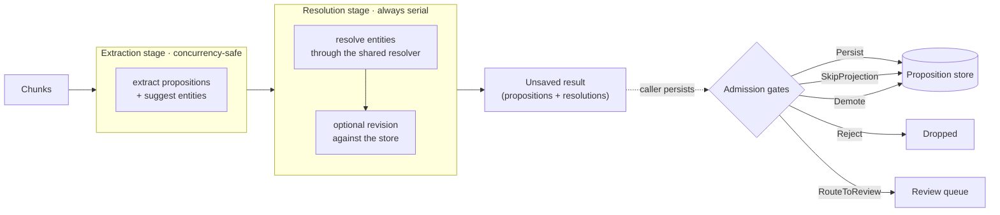
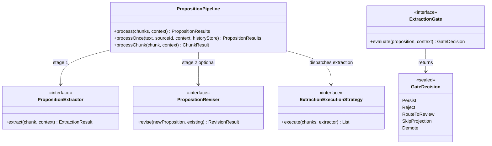
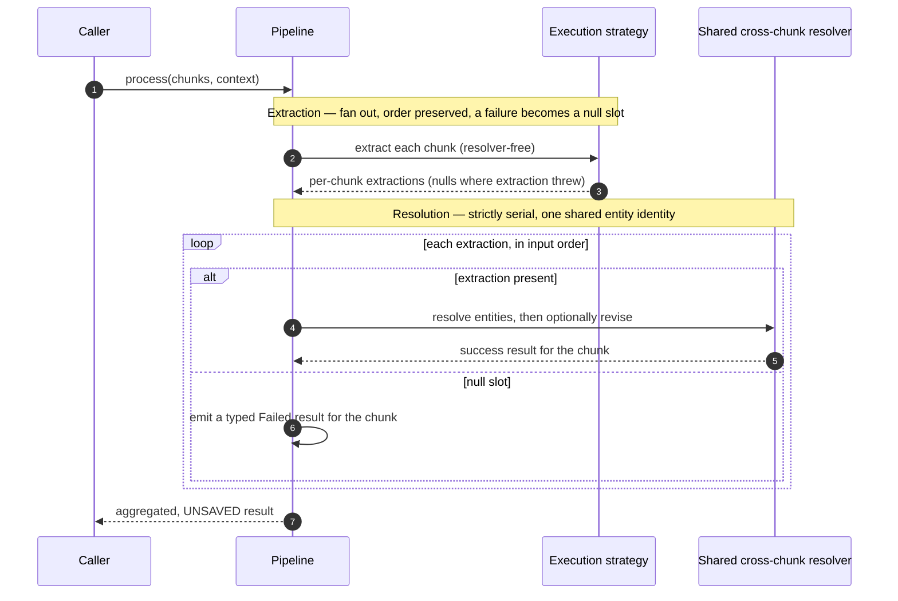
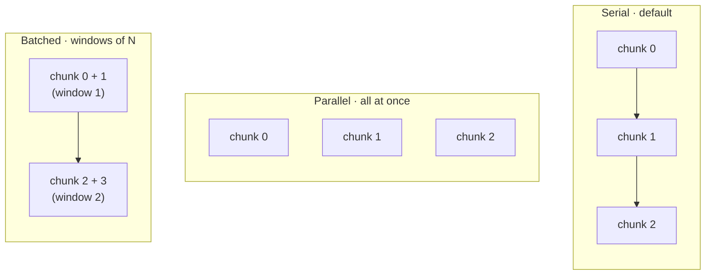
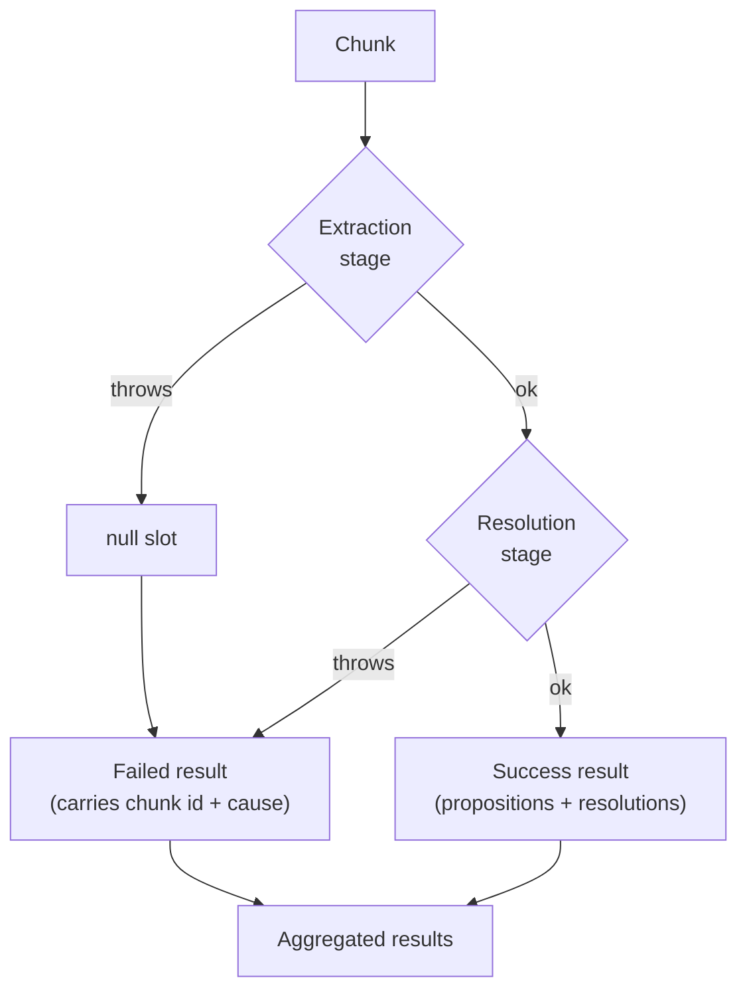
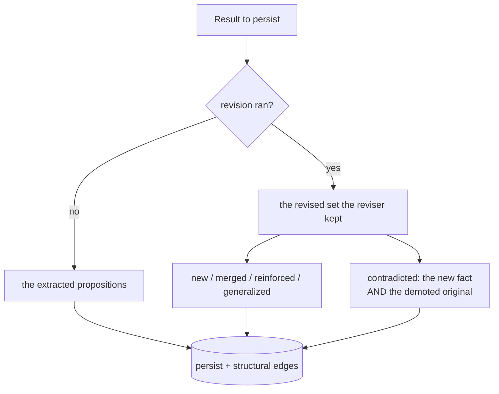

# Extraction pipeline: two stages, optional concurrency, and unsaved results

DICE turns raw text into grounded propositions through one pipeline. It chunks nothing and stores
nothing itself — it takes chunks in, extracts statements, resolves the entities those statements
mention, optionally reconciles them against what's already known, and hands back a result the
caller persists. This note is about three design decisions behind that flow: why extraction and
resolution are kept as separate stages, why only the extraction stage is allowed to run
concurrently, and why the pipeline deliberately writes nothing.

The pipeline produces the propositions that everything downstream then governs — the admission
gates decide what to keep, the lifecycle decides how each one ages, and the dream loop tidies them
later (see [knowledge-hygiene](knowledge-hygiene.md) and
[proposition-lifecycle](proposition-lifecycle.md)). This is where they come from.

The admission gates (see [knowledge-hygiene](knowledge-hygiene.md)) run between the pipeline result and the store — they are the caller's responsibility to apply.

## Pipeline SPI seams

Every variable part of the pipeline is a pluggable interface. This is how they fit together:

## Why extraction and resolution are separate

Extraction is two jobs wearing one coat. One reads a chunk and produces *candidate* statements and
the entities they mention — pure work that depends only on the chunk in front of it. The other
takes those candidates and decides *which real entities* they refer to, which means consulting a
resolver that accumulates identity across the whole run.

Keeping them as distinct stages is what makes safe concurrency possible at all. The extraction
stage (`extractStage`) touches no resolver and shares no state between chunks, so two chunks can be
extracted at the same time without stepping on each other. The resolution stage (`resolveStage`)
runs every chunk through one shared cross-chunk resolver so that "Brahms" mentioned in one chunk
lands on the same entity as "Brahms" in another — and that shared, mutating identity map is exactly
the thing you cannot touch from several threads at once. So the line between the two stages is also
the line between "parallelizable" and "must stay serial."

## Execution strategies

How the extraction stage is dispatched is a pluggable choice, separated from the pipeline behind a
small SPI so that turning on concurrency is a one-line swap rather than a rewrite. Three strategies
ship:

- **Serial** (the default) runs each chunk one at a time on the calling thread. It is the
  simplest, fully sequential behaviour, so the default pipeline has no concurrency to reason about.
- **Parallel** fans every chunk out at once onto an executor and joins them back in order.
- **Batched** processes fixed-size windows: each window runs concurrently, then fully completes
  before the next starts. This is the rate-limit lever — it caps how many extractions (and so how
  many model calls) are in flight at a time.

Every strategy honours the same two-part contract, and the contract is what lets the rest of the
pipeline stay simple. **Input order is preserved**: the result has one slot per input chunk, in
order. **A failure is a `null` slot, never an exception and never a dropped chunk** — when an
extraction throws, that slot comes back `null`, and the resolution stage turns it into a typed
`Failed` result. Nothing is silently reordered or lost, so the `result.size == chunks.size`
invariant always holds.

### Turning concurrency on is gated

Going faster than serial is opt-in for a reason: it is only safe if the `PropositionExtractor`
behind the pipeline — usually a language-model client — is itself safe to call from several threads
at once. That is a property of the extractor, not something the pipeline can guarantee, so the
default stays serial and a deployment is expected to verify thread-safety before switching. Until
then, `BatchedExtractionStrategy(batchSize = 1)` is the documented degrade-to-serial path: it goes
through the concurrent code path but never actually overlaps two calls, producing byte-identical
output to the serial strategy.

### Who owns the executor

A strategy either borrows an executor or makes its own, and the rule is symmetric with ownership. A
caller-supplied executor is never shut down by the strategy — its lifecycle belongs to whoever
created it. A strategy that creates its own pool (the no-executor constructors) owns that pool, and
both concurrent strategies are `AutoCloseable` so `close()` shuts down a self-created pool and
leaves a borrowed one alone. The practical guidance: inject and manage your own executor in a
long-lived application; use the no-arg constructor as a `use { }` resource for a one-off.

## Failure is isolated per chunk

The batch path treats every chunk as independent, so one bad chunk can't sink a whole document. A
chunk that throws during extraction becomes a `null` slot; a chunk that throws during resolution,
revision, or even event emission is caught in the resolution stage and turned into a `Failed`
result for that chunk alone. Either way the run finishes and the failures are visible —
`PropositionResults` exposes the ids of chunks that failed, and the REST layer surfaces them rather
than pretending everything succeeded.

Single-chunk processing is deliberately stricter. `processChunk` runs both stages serially on the
calling thread and lets an extraction exception propagate, because a caller handling one chunk
wants the error, not a quietly empty result. Only the batch `process` converts failures into
`Failed` slots, because that is where swallowing one chunk to save the other forty is the right
trade.

## The result, and who persists it

The pipeline returns **unsaved** results on purpose. `process`, `processChunk`, and `processOnce`
all write nothing to any repository; the returned value is discarded if the caller ignores it. The
reason is transaction ownership — DICE is a substrate a host application embeds, and that
application owns its database transaction. Baking writes into the pipeline would force its
persistence model onto every consumer; handing back what *should* be saved leaves the boundary, and
the rollback story, with the caller.

What to save is itself a small decision, captured in `propositionsToPersist()`. With no revision,
that's just the freshly extracted propositions. With revision, it's the set the reviser says to
keep — which crucially includes *modified existing* propositions, not only new ones. A contradiction,
for example, returns both the new fact and the existing one whose confidence was cut and status set
to `CONTRADICTED`; persisting only the new fact would silently leave the old one believed (see
[proposition-lifecycle](proposition-lifecycle.md)).

The convenience `persist()` helper writes the right propositions, saves only the entities those
propositions actually reference, and wires up the structural relationships between chunks,
propositions, and entities in one step — but it's still the caller who chooses to call it, inside
its own transaction.

## Revision, events, and provenance

When a reviser and a repository are configured, the resolution stage also reconciles each new
proposition against what's stored and classifies the relationship — new, merged, reinforced,
contradicted, or generalized. Those classifications drive the lifecycle transitions described in
[proposition-lifecycle](proposition-lifecycle.md), and each one emits a *pre-persistence* event so a
consumer can watch reconciliation happen; the durable record is still the `PropositionPersisted`
the store emits on save (see [events](events.md)). `processOnce` adds a hash check so re-ingesting
the same text is a no-op, and lets a caller attach extra grounding ids — the source records a fact
came from — that later become provenance edges.

## Configurable behavior

The extractor, the optional reviser and mention filter, the event listener, and the execution
strategy are all pluggable through the pipeline's fluent builders. What ships is intentionally
conservative — serial execution, revision off, no persistence — so the safe, predictable behaviour
is the default, and a deployment opts into concurrency, reconciliation, and its own write boundary
as it needs them.
