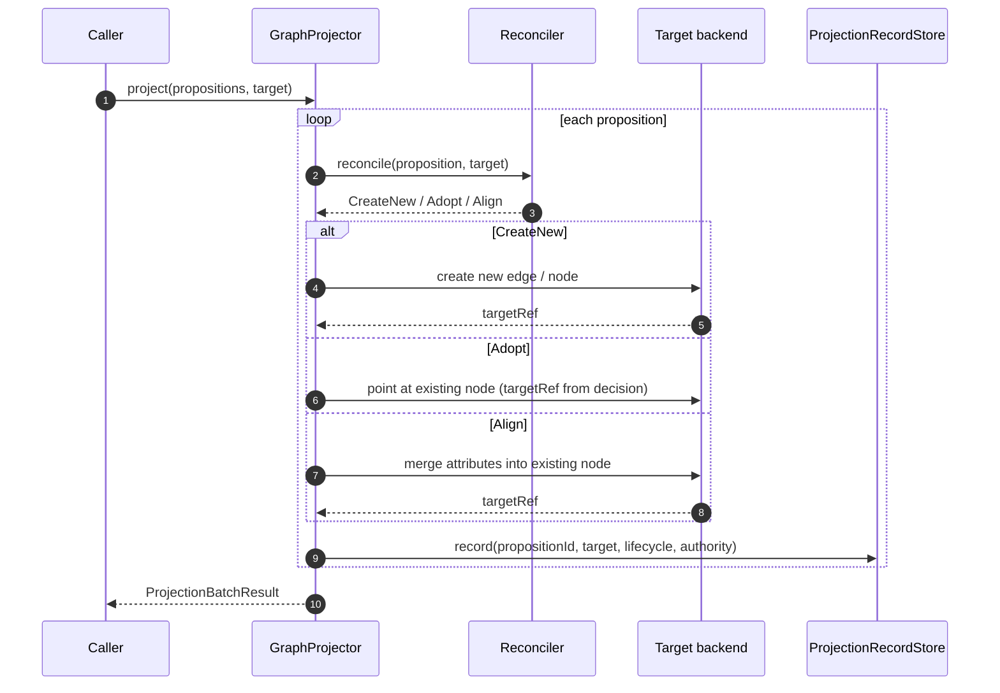
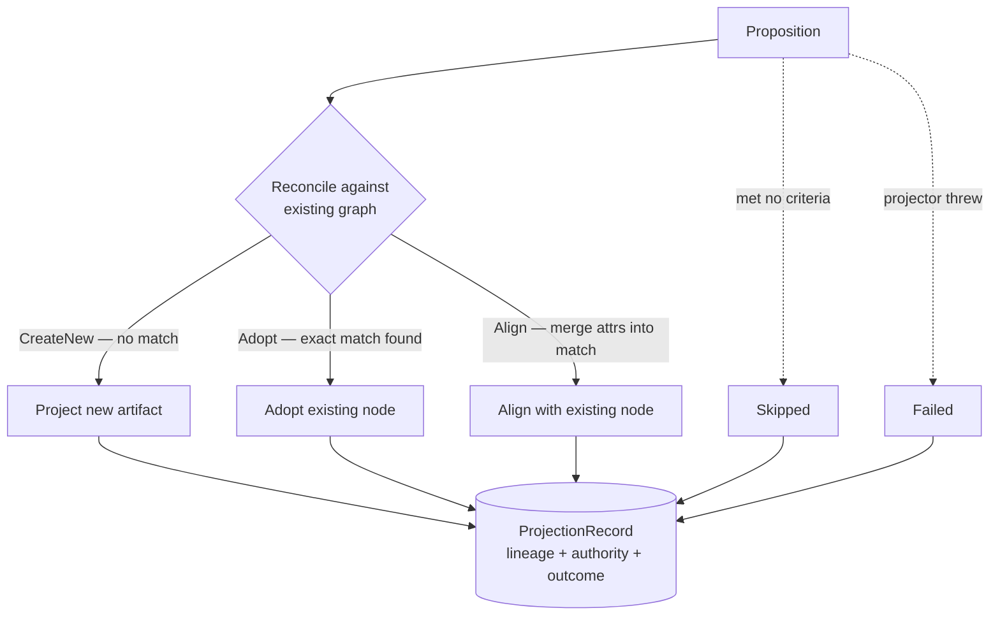
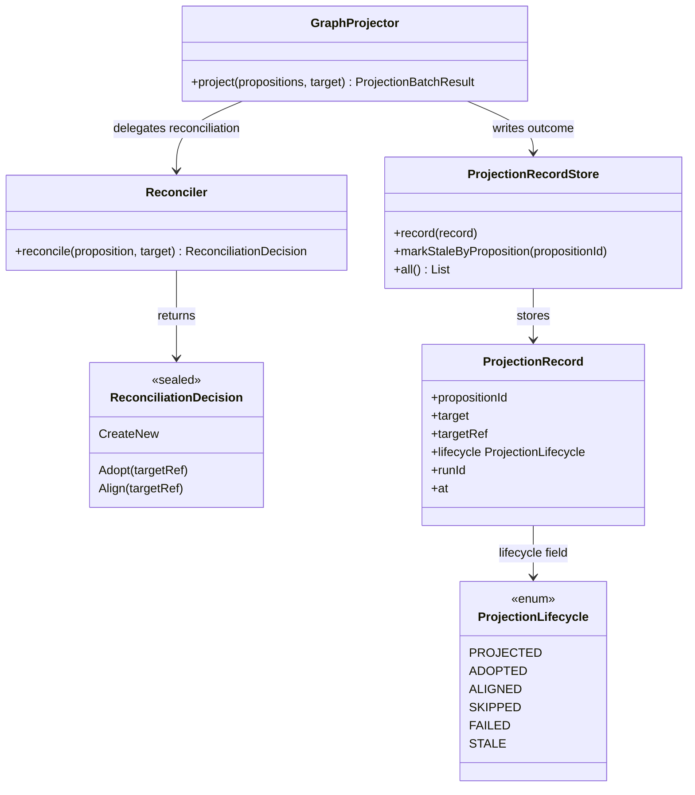
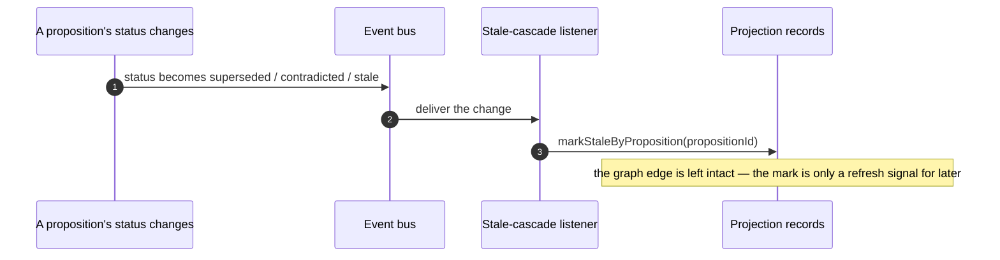

# Graph projection: lineage, outcomes, and staleness

DICE projects its propositions into a typed graph so they can be queried as entities and
relationships. Projection is easy to get wrong in ways that quietly erode trust: edges with no trail
back to their evidence, duplicate nodes on every re-run, and stale structure left behind when the
underlying facts change. This note is about the decisions that keep the projected graph honest — not
about the projector classes themselves.

## The projection pipeline

Propositions flow from the store through a reconciler and into the target backend, with a
`ProjectionRecord` written for every outcome whether the proposition lands as a new artifact, adopts
an existing one, is skipped, or fails. The authority tier travels with the record.

After the batch, the `EventEmittingProjector` decorator publishes a `ProjectionBatchCompleted`
event so downstream consumers can react without polling.

## Edge lineage

When a proposition becomes a graph edge, that's not the end of the story — DICE writes a record of
it. Each projection result becomes a `ProjectionRecord` (which proposition, which target, which
graph artifact, the outcome, and when), and the projected edge itself carries the IDs of the source
propositions and the authority tier of their source.

The reason is auditability. An edge with no provenance is an opaque assertion: you can't ask "where
did this come from?" or "how much should I trust it?" Keeping the record turns the graph into
something you can interrogate. The record store is even reversible — given a node in the graph you
can find every record that created or adopted it — so a graph artifact can always be traced back to
the text that justified it.

Authority travels with the edge for the same reason it matters everywhere else (see
[proposition-lifecycle](proposition-lifecycle.md)): a relationship derived from a first-party record
shouldn't be weighed the same as one inferred from a passing mention. The tier is re-stamped
whenever an edge is re-persisted, so it's never silently lost.

## Projection outcomes

Projection isn't a boolean. A proposition might be successfully projected as a new edge, *adopted*
onto a node that already existed, *aligned* by merging attributes into a match, *skipped* because it
met no projection criteria, or *failed* because something threw. DICE records which of these
happened for every proposition, with a reason for the skips and failures.

The point is that these outcomes mean different things to whatever decides what to re-project later.
"Nothing to do here" and "this broke" look identical if you only track success/failure, and you'd
either retry things that were fine or ignore things that need attention. Distinguishing *adopted*
from *newly projected* also records the reconciliation decision in the lineage, not just in the
graph write.

The reconciler returns one of three decisions — `CreateNew`, `Adopt`, or `Align` — each recorded in the lineage.

`CreateNew` creates a fresh artifact in the target backend. `Adopt` reuses an existing artifact verbatim — the proposition's projected identity becomes that node's reference. `Align` is the middle option: the proposition merges attributes into an existing artifact while keeping its own distinct identity (for example, a projector that enriches an existing entity node rather than pointing at it wholesale). The shipped `RepositoryBackedReconciler` uses exact entity-ID match to return `Adopt` or `CreateNew`; `Align` is available for backends that need finer-grained merging.

## SPI seams for projection

The projectors, the reconciler, and the record stores are all SPIs. Here is how they fit together:

The in-memory `InMemoryProjectionRecordStore` and the durable `DrivineProjectionRecordStore` (in
`dice-storage`) both satisfy this SPI — the durable one persists `(:ProjectionRecord)` nodes in
Neo4j so lineage survives a restart.

## Stale-cascade on source change

The graph is downstream of the propositions, so it can fall out of date. When a proposition reaches
a terminal lifecycle state — superseded, contradicted, or stale — a listener marks every projection
record derived from it as stale.

Two deliberate choices live here. First, the trigger is the proposition's *status change*, not a
manual sweep, so the graph self-heals as a side effect of the lifecycle rather than needing a
separate reconciliation job to remember. Second, the cascade only marks the *records* stale; it
doesn't rip out the actual edge. Edge removal or refresh is a re-projection concern, and keeping the
cascade to a fast, idempotent "flag it" step means a status change never triggers expensive graph
surgery inline. The stale flag is a signal to downstream consumers that the edge needs a refresh,
not the refresh itself.

The trigger is the `PropositionStatusChanged` event (see [events](events.md)) — this cascade is the
one place DICE consumes its own events, so nothing has to remember to run it:

## Idempotent ingestion and reconciliation

Re-running ingestion or re-projecting a source should be safe and cheap. DICE guards both ends.

At the **front door**, content is dedup'd by hash before any extraction runs. Extraction is an LLM
call; doing it twice on identical content wastes money and mints duplicate propositions. The ledger
claims a content hash atomically so two concurrent ingests of the same artifact can't both proceed —
and if extraction fails, the claim is released so a transient error doesn't permanently block
re-ingestion. (A second, durable layer tracks processed chunks across sessions for the incremental
path.)

At the **graph end**, a reconciler checks the live graph before creating anything: if an entity a
proposition mentions already exists, the projection adopts that node instead of minting a duplicate.
The default match is exact-ID and deterministic — the reconciler would rather create a clean new
node than guess a fuzzy match and merge two things that aren't the same.

The unifying idea is that ingestion and projection are operations you'll run repeatedly over
overlapping material, so they're built to converge rather than accumulate.

## Backend access through a port

The durable backend is Neo4j, but the core never depends on it directly — it depends on SPIs.
Proposition storage sits behind the `PropositionStore` interface, lineage and other records behind
their own store interfaces, and the entity/relationship axis behind embabel-agent's entity-repository
port. All the Neo4j-specific wiring lives in the storage module; domain code never imports a graph
driver. Because the core talks only to those interfaces, you can swap the backend or test against an
in-memory substitute.

One consequence worth noting: the entity-repository-backed proposition store deliberately declares
only what it can honestly support — plain storage and vector search — and not proposition-scoped
graph traversal or temporal queries, because the entity-scoped repository can't genuinely back them.
That's the same "declare only what you really support" stance the store layer takes.

## Configurable behavior

The reconciler, the projection record store, and the authority resolver are all pluggable. What
ships favours safety — create-new when unsure, record everything, resolve authority from provenance —
so the conservative behaviour is the default and a deployment tightens it where it needs to.
