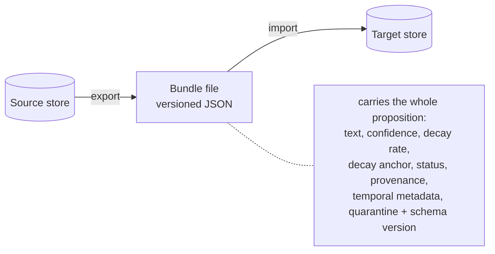
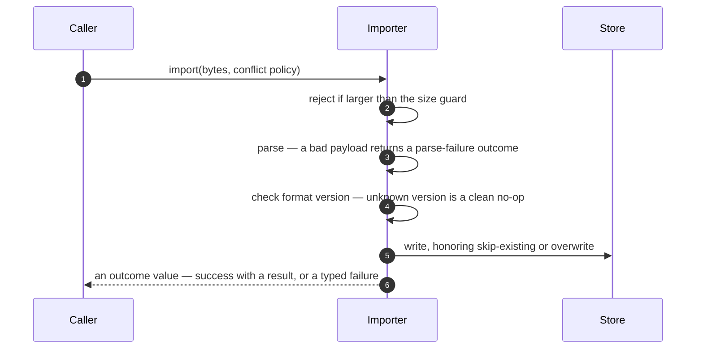

# Knowledge bundles: export and import

A knowledge bundle is a self-contained, versioned file that holds a set of propositions so a graph
can be snapshotted, archived, shared, or carried to another deployment without a live store. Export
and import are the obvious part. The decision worth writing down is what a bundle *preserves* — and
why getting that wrong would quietly corrupt the knowledge it's meant to move.

## Full-proposition fidelity

The tempting, naïve bundle captures a fact's text and confidence and little else. The problem is
that DICE's confidence isn't static — it decays from the moment the content last changed (see
[proposition-lifecycle](proposition-lifecycle.md)). If a bundle dropped that anchor, every
proposition would arrive looking brand new on import, and a year-old stale fact would suddenly read
as fresh and confident. Time-sensitive retrieval would be quietly wrong.

So a bundle carries the full proposition, including everything decay and lifecycle depend on: the
decay rate, the timestamp that anchors decay, the lifecycle status, reinforcement count, temporal
metadata, provenance, and the metadata that records quarantine state and the schema version a fact
was extracted under. The consequence is fidelity: a reloaded proposition keeps aging from its
original extraction time rather than the import time, a fact that was stale arrives stale, and one
that was quarantined arrives quarantined. The bundle moves knowledge; it doesn't reset it.

## Defensive import

A bundle can come from another deployment or a different version of the library, so import is built
to be defensive without being brittle. It's forward-compatible — a bundle written by a newer
version with extra fields still loads in an older one, and an unrecognized format version is
rejected cleanly before anything touches the store. The string entry point also caps payload size
before parsing, so an oversized bundle can't force an unbounded read. And failures are returned as
outcomes — unknown version, parse failure, success —
rather than thrown, so a caller importing a stranger's bundle handles the bad cases as ordinary
results instead of catching exceptions.

On the way in, the caller chooses how conflicts with existing propositions resolve — skip what's
already there, or overwrite it — so importing into a populated store is a deliberate act, not an
accident.

## Configurable behavior

The bundle format sits behind exporter and importer interfaces; the shipped pair is JSON, and the
seam exists so another encoding could take its place. The defaults are cautious: skip existing
propositions on import, reject anything unrecognized up front, and never silently
discard the fields that make a proposition more than its text.
