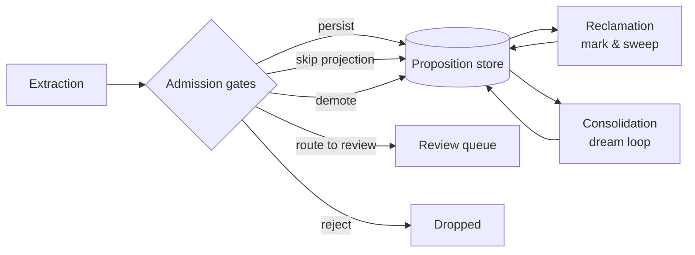
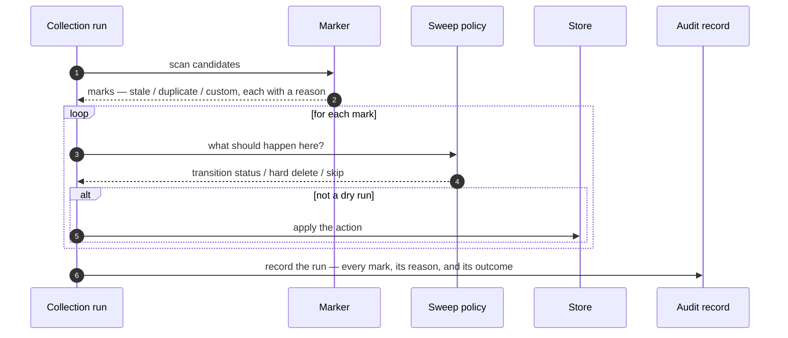
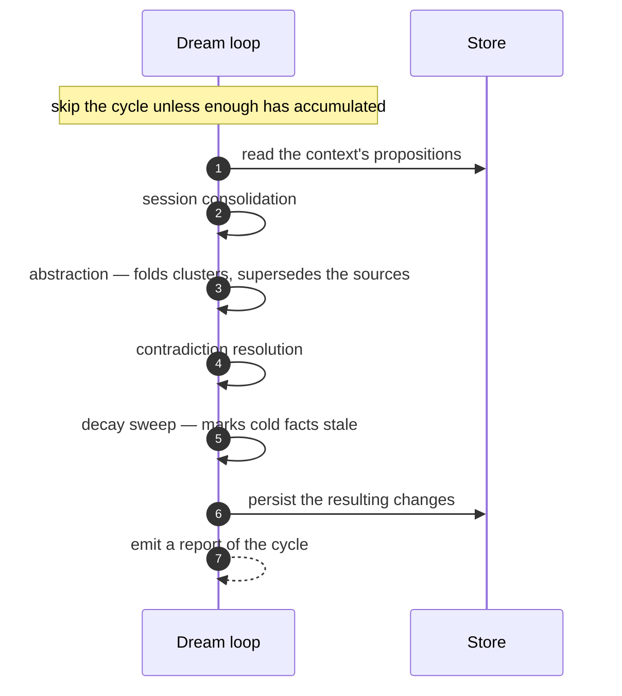

# Knowledge hygiene: admission, reclamation, and consolidation

A store of facts that an LLM extracts from raw text will rot if you let it. Junk gets admitted,
duplicates pile up, contradictions sit unresolved, and stale entries never leave. DICE treats
hygiene as three deliberate interventions at three different moments — what we let *in*, what we
*reclaim*, and what we *consolidate* between sessions. This note is about why those three exist as
separate decisions, not about the classes that implement them.

All three ship conservative defaults and are pluggable. The theme throughout: prefer reversible,
auditable moves over destructive ones, because a knowledge base you can't trust to keep what it was
told is worse than one that grows a little.

## Admission gates

Freshly extracted propositions don't flow straight into the store. They pass through a gate
sequence that gives each one an explicit, recorded decision: **persist** it, **route it to
review**, **reject** it, **skip projecting** it into the graph, or **demote** a relation that
falls below an evidence floor.

The reason to gate at admission rather than clean up afterwards is cost and clarity. It's cheaper
to never admit junk than to find and remove it later, and a low-confidence fact is easier to judge
the moment it arrives, with its extraction context still close at hand. The **evidence floor** is
the sharpest example of the design intent: a relation that isn't backed by enough evidence
shouldn't shape the graph, but the underlying proposition isn't worthless — so we demote the
relation rather than discard the fact.

Every gate decision is recorded in the pipeline's result, so you can see after the fact why a
proposition was persisted, held for review, rejected, or demoted — which matters because admission
policy is exactly the kind of thing teams tune over time and need to be able to reason about. Wrap
the gates in the observable decorator and each non-persist decision also emits an event — rejected,
routed to review, projection-skipped, or demoted — so a consumer can watch admissions live. A
persisted proposition stays silent here, because the save boundary already emits that
(see [events](events.md)).

## Reclamation: mark and sweep

Reclamation borrows the shape of a tracing garbage collector on purpose: one stage decides *what
looks like garbage*, a separate stage decides *what to do about it*, and every action leaves a
record.

The internals — the strategies, the sweep policy, the entry points, and the audit trail — are in
[reclamation-and-collector](reclamation-and-collector.md); this section is the why.

Splitting "mark" from "sweep" keeps two independent judgments independent. A marker flags a
proposition with a reason — it's gone **stale**, it's a **duplicate** of a survivor, or some
domain-specific reason — without committing to a fate. The sweep policy then chooses the fate:
move it to a new lifecycle status, hard-delete it, or skip it. Keeping these apart means you can
change what counts as garbage without touching what happens to it, and vice versa.

The default fate is deliberately non-destructive: a marked proposition is transitioned to a colder
status, not deleted. Hard deletion is available but opt-in. This is the same instinct as the
lifecycle's "decay, don't delete" stance (see [proposition-lifecycle](proposition-lifecycle.md)) —
losing data quietly erodes trust in the whole store.

Reclamation is built to be auditable: when an audit trail is configured, a run records what was
marked, why, and what happened to it — and a **dry run** records that trail while changing nothing,
so you can preview a policy before it touches real data. Duplicate handling resolves overlapping
clusters down to a single survivor, so merging is deterministic rather than order-dependent.

Each status transition a sweep applies also emits a `PropositionStatusChanged` event (on real runs,
not dry runs) — the same event the store emits when a status changes, so a transition made by the
collector looks identical to one made anywhere else (see [events](events.md)).

A run marks candidates, lets the policy decide each one's fate, and records the outcome:

## Consolidation: the dream loop

Admission and reclamation keep the store from filling with bad data, but they don't make good data
*better*. That's the job of the dream loop: a set of consolidation passes that run as repeatable
cycles, ideally during idle time, to tidy what's already there.

How the passes compose into a cycle, and how the loop is triggered and locked, is in
[consolidation-and-dream-loop](consolidation-and-dream-loop.md); this section is the why.

The passes are composable and each does one thing: fold a session's raw facts together, abstract a
cluster of related facts into a higher-level proposition, resolve lingering contradictions, and
sweep decayed entries. Composability is the design decision — consolidation isn't one monolithic
LLM step you either run or don't; it's a pipeline of small, individually understandable, repeatable
operations you can reorder, extend, or run on their own.

The loop is threshold-gated: it only does expensive work when there's enough accumulated material
to be worth it, so running it often is cheap when nothing has changed. And it ties directly back to
the lifecycle — abstraction is what drives **supersession**, contradiction resolution is what
drives **contradiction**, and the decay sweep is what moves cold facts toward **stale**. The dream
loop is, in effect, where most lifecycle transitions other than first ingestion actually get
triggered.

A cycle runs its passes over a context's propositions and reports what changed:

## How the stages combine

The three stages act at different points in a proposition's life. The **gates** run at admission and
decide what enters the store. The **mark-and-sweep collector** runs continuously and reclaims
propositions that are no longer worth keeping, preferring a status transition over deletion. The
**dream loop** runs periodically and consolidates what's already stored so it stays concise and
consistent rather than only growing. The proposition lifecycle ties all three together.

## Configurable behavior

The gate sequence, the marker strategies and sweep policy, and the consolidation passes are all
pluggable. What ships is intentionally cautious — admit unless clearly bad, reclaim into a colder
status rather than delete, consolidate only past a threshold — so the safe behaviour is the default
and a deployment opts into anything more aggressive.
