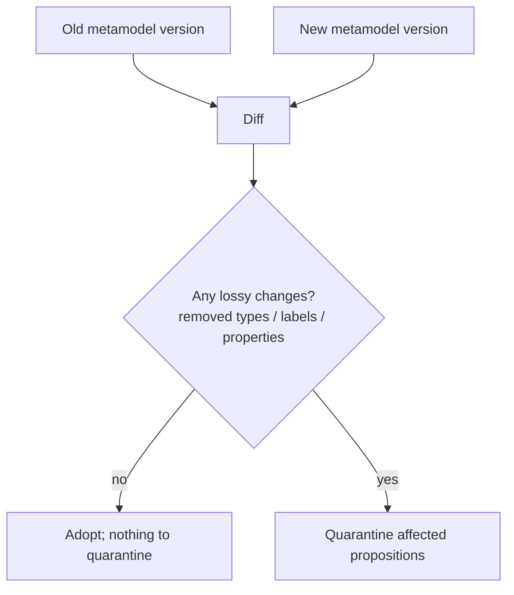
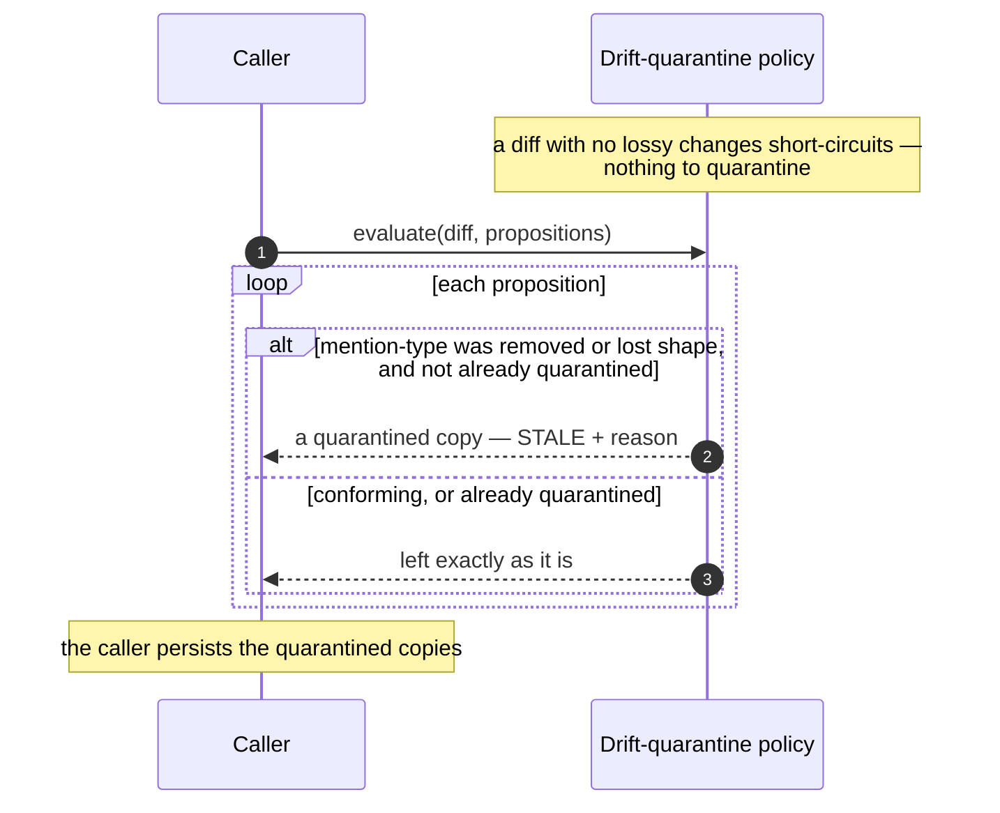

# Metamodel governance: versioning, diffing, and drift quarantine

DICE extracts entities and relationships against a metamodel — the schema of entity types, their
labels and properties, and the relationships allowed between them. That schema isn't frozen; it
changes as a domain is understood better. The risk is that a schema change quietly invalidates
propositions that were extracted under the old shape, leaving the graph full of references to types
that no longer mean what they used to. This note is about the decisions that let the metamodel move
without poisoning existing knowledge.

## Versioned schema stamps

At any moment the live schema can be captured as an immutable **metamodel version** — a sorted,
deterministic snapshot of every entity type, its full label and property sets, and the allowed
relationships — fingerprinted with a content hash. That stamp, not the mutable live dictionary, is
what you store and compare.

The reason is reproducibility. The live schema can drift between when a proposition was extracted
and when you later need to reason about schema changes; a stamp gives you a fixed point to compare
against. Two design choices sharpen it: the hash deliberately excludes the schema's *name*, so the
same structure in a dev and a prod environment fingerprints identically; and any real change — even
adding one label to a type whose name is unchanged — produces a different hash. A proposition can
record the version it was extracted under, which is what later lets the system tell which
propositions a schema change actually affects.

## Diffing additive vs. lossy changes

Before taking on a new schema version, DICE computes a **diff** against the old one that enumerates
exactly what changed — types added or removed, and per-type labels and properties added or removed.
The diff isn't a summary or a flag; it's the concrete input the quarantine step reads.

The distinction that matters is *additive vs lossy*. Adding types, labels, or properties is safe —
nothing that was valid before becomes invalid, so a purely additive change can be adopted without
disturbing anything. Removing a type, or stripping labels or properties from a type that mentions
relied on, is lossy: it can orphan existing references. Computing the diff up front means the system
can fast-path the common, safe case and only do real work when a change can actually break something.

## Drift quarantine

When a change is lossy, the propositions whose entity mentions reference an affected type have
*drifted* — they point at a type that was removed, or that lost a label or property they may have
relied on. DICE moves each of those propositions to **stale** and annotates it with a
human-readable reason, as an immutable copy. It is not deleted, and it is not left sitting in the
graph looking valid.

This is the same instinct as the rest of the lifecycle (see
[proposition-lifecycle](proposition-lifecycle.md)): silently leaving drifted propositions in normal
retrieval would corrupt query results, but deleting them would destroy information that a human
might want to rescue. Quarantine takes the middle path — pull them out of normal use, keep them,
and flag *why* — so a person can review and decide.

Two properties make this safe to run as routine maintenance. It's **non-destructive**: the original
proposition is never mutated; a quarantined copy is produced and the caller persists it. And it's
**idempotent**: a proposition that's already quarantined from an earlier sweep is left exactly as it
is, original reason intact, rather than being re-flagged or overwritten. Re-evaluating one
deliberately requires clearing its quarantine annotation first.

A sweep takes a diff and the propositions, and decides each one independently:

## Configurable behavior

Diffing and quarantine are both policies. The shipped diff does a cheap, deterministic shape
comparison, and the shipped quarantine policy keys on whether a mention's type was removed or lost
shape. Both are swappable, and the default stance is conservative: only lossy changes ever trigger
quarantine, and quarantine preserves rather than destroys.
