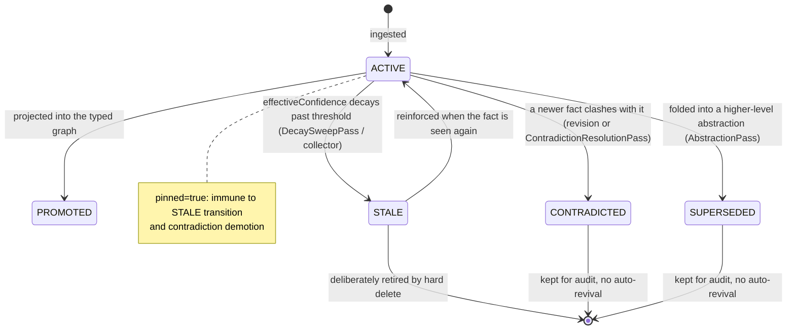
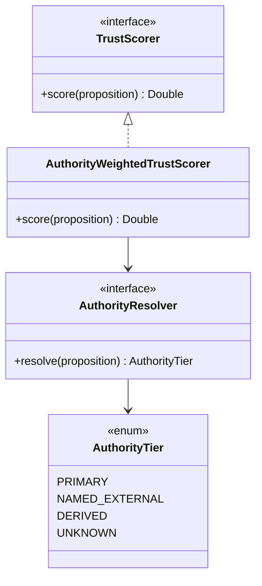
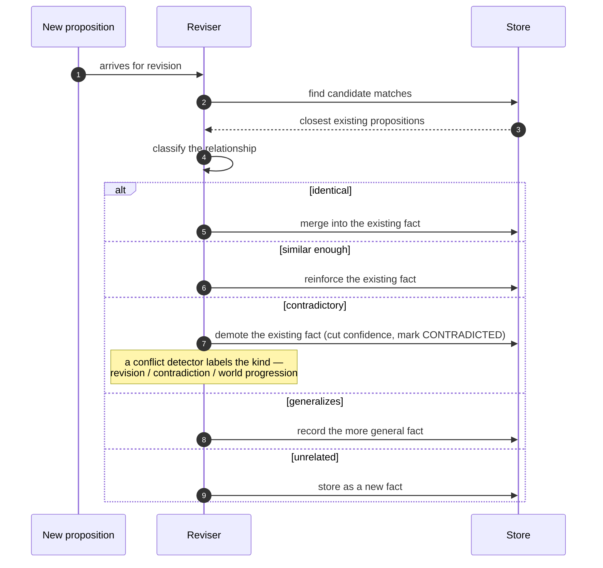
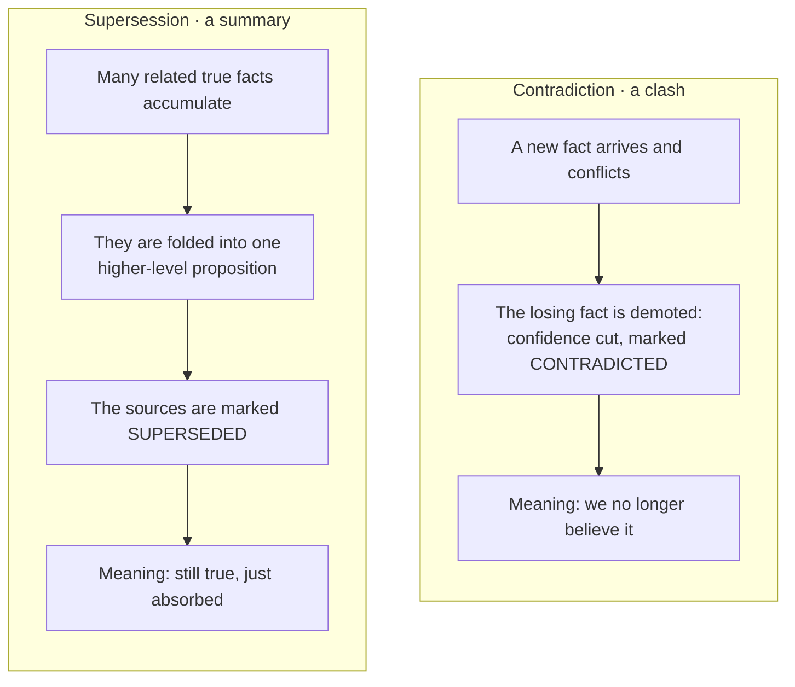
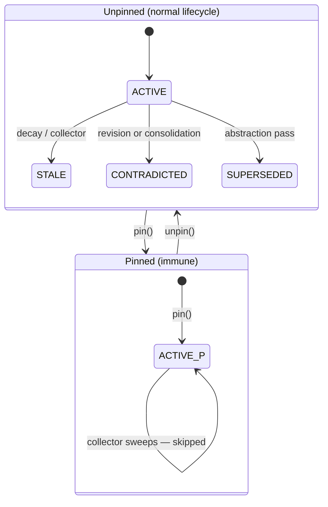

# Proposition lifecycle: trust, conflict, supersession, and decay

DICE keeps what it knows as **propositions** — small natural-language statements grounded in
source material, like "Alice works at Acme." This document isn't about the classes that store
them; you can read those. It's about the decisions behind how a proposition *behaves* over its
life: how it earns or loses trust, what happens when two of them disagree, when one quietly
replaces others, and why knowledge fades rather than being deleted. These are the choices you
can't recover by reading any single type.

## Lifecycle overview

A proposition is born **active** and stays that way for as long as it's believed and current.
From there a handful of things can happen to it, and the shape of those transitions is itself a
design decision — most exits are one-way, and almost none of them actually destroy the record.

What triggers each transition:
- **ACTIVE → CONTRADICTED**: `LlmPropositionReviser` at ingest time, or `ContradictionResolutionPass` during a dream-loop cycle.
- **ACTIVE → SUPERSEDED**: `AbstractionPass` during a dream-loop cycle, when a cluster of facts is folded into a higher-level proposition.
- **ACTIVE → STALE**: `DecaySweepPass` (via the mark-and-sweep collector), or the scheduled decay tick in `GraphDecayManager`.
- **STALE → ACTIVE**: `PropositionReviser` on re-ingest, which reinforces the existing proposition and resets its confidence.
- **PROMOTED**: set by `GraphProjector` on successful projection into the typed graph; it complements ACTIVE rather than replacing it.

The rest of this document is the reasoning behind those transitions.

## Trust and authority SPI seams

## Trust scoring is advisory

Every proposition can be scored for how much its *source* should be believed, but that score
never deletes, rewrites, or hides anything. It's advisory: it ranks, and the consumer decides
what to do with the ranking.

The reason is that destructive automation on a knowledge base is hard to undo and easy to get
wrong. A confident-sounding extraction from a sketchy source shouldn't silently erase a quieter
fact from a good one — it should just lose when something has to choose. So trust is a number a
query filter or a ranker can lean on, not a gate baked into the store.

This is why the shipped scorer is deliberately neutral (it trusts everything equally). The seam
exists so that real deployments opt *in* to a judgment model; nothing changes until they do.

## Source authority from provenance

When DICE does reason about trust, the dominant signal is **where a fact came from**, not how
confident the language model sounded. Sources fall into tiers: first-party records outrank named
external sources, which outrank derived or inferred material, which outranks "we don't know."
When a proposition has mixed grounding, the strongest source it can point to wins. This is a
deliberately optimistic default — one primary record among ten weak ones makes the whole proposition
primary — chosen because a single authoritative source genuinely does vouch for the fact; a
deployment that wants the opposite (weakest-link, or a blend) should expect to override the resolver.

Two things drove this. First, provenance is a more honest trust signal than self-reported
confidence — a primary record is trustworthy for reasons that have nothing to do with how a
sentence is phrased. Second, "unknown" has to be a real tier and the fail-safe default, because
plenty of propositions arrive with thin grounding and we'd rather treat those cautiously than
flatter them.

## Conflict classification

DICE separates two things: working out how a new proposition relates to what's already stored, and
naming *what kind* of clash it is when they conflict.

The reviser does the first. When a proposition arrives, it classifies the relationship to the
existing facts and acts on it — merging an identical fact, reinforcing a similar one, demoting the
existing fact when the two contradict (its confidence is cut and its status set to contradicted),
recording a generalization, or storing an unrelated fact as new.

A conflict detector does the second, and only for the contradictory case — it labels *why* the two
clash:

- **Revision** — the new statement is a more accurate version of the same fact (a correction).
- **Contradiction** — the two are mutually exclusive; one of them is wrong.
- **World progression** — both were true at different times; the world moved on (Alice changed
  employers).
- a **custom** kind, for domain-specific clashes the first three don't cover.

The label is recorded on the result for downstream consumers to use; the existing fact is demoted
either way. Capturing the kind matters because treating every disagreement as a flat contradiction
throws away the difference between a correction, a real conflict, and a fact that's simply newer.
The shipped detector is conservative — it labels every clash a contradiction — until a richer one
is wired in.

## Supersession vs. contradiction

These two look similar — both end with an older proposition stepping aside — but they mean
opposite things, and collapsing them would either lose nuance or wrongly discredit good facts.

**Contradiction** happens in the moment a new proposition arrives and is judged to conflict with an
existing one. The loser is demoted — its confidence is cut and it's marked contradicted. The
statement we're making is "this is no longer believed."

**Supersession** happens later and for the opposite reason. During background consolidation, a
cluster of true, low-level facts about the same thing gets abstracted into a single higher-level
proposition. The originals aren't wrong — they've been *absorbed* — so they're marked superseded
rather than contradicted. The statement is "there's now a better way to say all of this at once."

Two consequences fall out of keeping them distinct: each transition answers a different question
("was this wrong?" versus "is there a better summary now?"), and in both cases the original record
is kept for audit. We don't pretend we never believed something.

## Decay instead of deletion

A proposition's believability falls off over time, but the clock is anchored to the last time its
**content** changed — not to housekeeping touches like re-scoring trust or flipping a flag.
Re-deriving an old conclusion shouldn't look fresh, and re-scoring a fact shouldn't make it look
stale. So administrative edits leave the decay clock alone.

Decay moves a proposition toward **stale**, not toward the trash. The boundary uses two thresholds
— a fact has to fall well below the line to go stale and climb well above it to come back — so it
doesn't flap back and forth near the edge. And the only thing that genuinely revives a stale fact
is seeing it again (reinforcement), not the passage of time. Hard removal exists, but it's a
separate, deliberate step: the default preference is "cold" over "gone," because a knowledge base
that quietly deletes things is one you stop trusting.

## End-to-end walkthrough

Follow one fact through its life. It's ingested **active** and scored by the authority of its
source. It may get **promoted** when it's projected into the typed graph. Later a conflicting fact
arrives; the reviser demotes the older fact (its confidence cut and its status set to contradicted)
and a conflict detector labels what kind of clash it was. If nothing references the fact for a while its
effective confidence decays until it goes **stale**, where it waits to be either reinforced back to
active or eventually retired. Or, if many siblings about the same entity pile up, a consolidation
pass folds them into one abstraction and our fact is marked **superseded** — still true, now said
more concisely.

## Pinning: permanent protection from the lifecycle

Some propositions should never be retired by automated maintenance — a baseline identity claim, a
manually curated anchor, a regulatory record. Pinning is how you express that: a pinned
proposition is immune to every automated lifecycle transition.

Concretely, the `pinned` field on `Proposition` is a boolean flag you set via `PropositionStore.pin(id)` and clear via `unpin(id)`. When it is true, three things change:

- The decay collector's default sweep policy (`StatusTransitionSweepPolicy`) skips the proposition unconditionally, regardless of what marks it carries — pinned means exempt from reclamation.
- The contradiction path in `LlmPropositionReviser` does not demote it when a conflicting fact arrives; instead, the new fact is stored alongside and the conflict is left for explicit resolution.
- The dream-loop's contradiction resolution pass (`ContradictionResolutionPass`) inherits the same skip-if-pinned behavior, so background consolidation also respects the pin.

Pinning is an *administrative* operation — it touches only `metadataRevised` and never resets the decay clock (`contentRevised` stays untouched).

Use `PropositionQuery.withPinned(true)` to list all pinned propositions in a context
(`PropositionStore.findPinned(contextId)` wraps that). Unpin when you're ready to let the
lifecycle resume.

## Configurable behavior

Trust scoring, authority resolution,
conflict characterization, and the rules for status transitions are all pluggable. The defaults
that ship are intentionally conservative — neutral trust, provenance-based authority,
assume-contradiction, gentle decay — so the safe behaviour is the one you get out of the box, and a
real deployment is expected to swap in the judgment that fits its domain.
