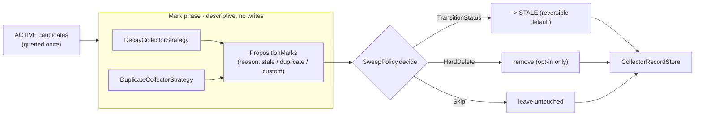
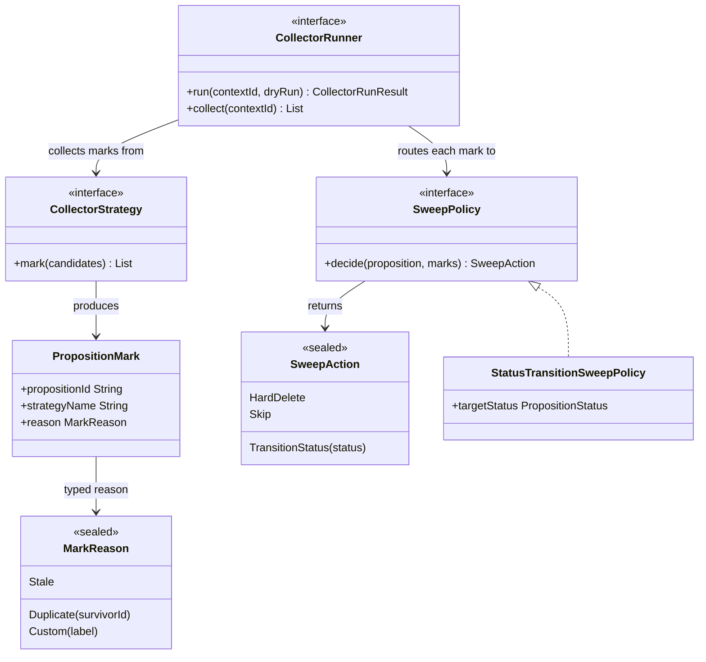
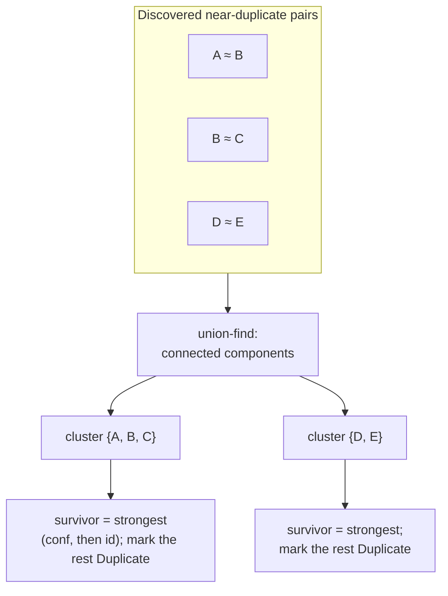
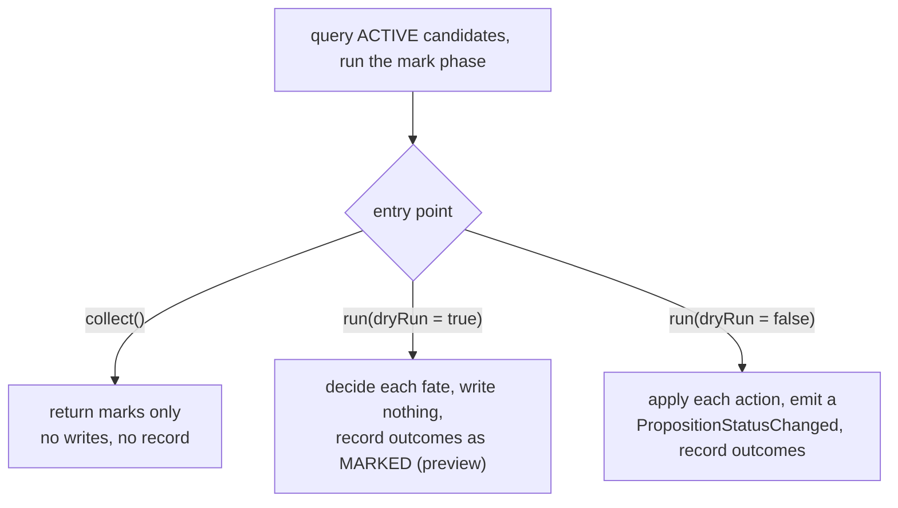
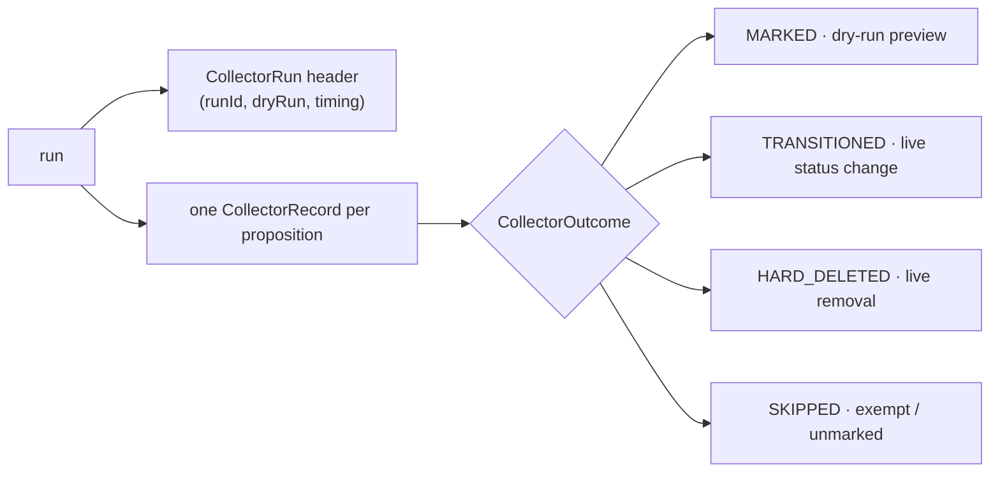

# Reclamation and the collector: mark, sweep, and the audit trail

Some propositions stop being worth keeping — they decay until no one believes them, or a newer
duplicate makes them redundant. Reclamation is the intervention that finds and retires them, and it's
built as a tracing garbage collector on purpose: one stage decides *what looks like garbage*, a
separate stage decides *what to do about it*, and every action leaves a record. The
[knowledge-hygiene](knowledge-hygiene.md) note covers *why* mark and sweep are kept apart; this note
is about *how* the collector is built — the strategies, the sweep policy, the entry points, and the
audit trail.

## Collector SPI seams

`StatusTransitionSweepPolicy` is the default — it skips pinned propositions unconditionally,
skips anything unmarked, and otherwise transitions to `STALE`. It never returns `HardDelete`.

## The mark phase: strategies and marks

A `CollectorStrategy` inspects the candidate set and flags propositions, producing `PropositionMark`s
— each carries the proposition id, the strategy name, and a typed `MarkReason` (`Stale`, `Duplicate`,
or a domain-specific `Custom`). Marking is **purely descriptive**: a strategy never mutates anything,
it only reports what looks reclaimable. Two strategies ship:

**`DecayCollectorStrategy`** marks a proposition whose `effectiveConfidence()` has fallen below a
retirement threshold — the decay path into staleness (decay itself is covered in
[proposition-lifecycle](proposition-lifecycle.md)). It reads only; the fate is the sweep's call.

**`DuplicateCollectorStrategy`** finds redundant propositions by treating "is a duplicate of" as edges
in a graph and collapsing each connected component to one survivor. It uses union-find so that
overlapping pairs (A≈B, B≈C) resolve to a single cluster {A,B,C} rather than fighting over who merges
with whom — the result is deterministic regardless of the order pairs are discovered. Within a cluster
the survivor is the strongest member (highest effective confidence, ties broken by id), and everyone
else is marked `Duplicate`.

## The sweep phase: policy and actions

A `SweepPolicy` looks at a proposition and its marks and returns a `SweepAction` — `TransitionStatus`,
`HardDelete`, or `Skip`. The policy only *decides*; applying the action is the runner's job, which
keeps "what counts as garbage" (strategies) independent from "what happens to it" (policy).

The default `StatusTransitionSweepPolicy` is deliberately safe: it skips pinned propositions no matter
what marks they carry, skips anything unmarked, and otherwise transitions to `STALE`. It **never**
returns `HardDelete` — the shipped default is reversible, and destructive removal is something a
deployment opts into with a different policy.

## Entry points: collect, dry run, live run

The `CollectorRunner` has two entry points and the run has two modes, separating "what would happen"
from "make it happen":

`collect()` is mark-only — useful when a caller wants to see candidates without touching anything. A
**dry run** decides every fate and writes the audit trail but mutates nothing, so a policy can be
previewed against real data before it's let loose. A **live run** applies each decision, emits a
`PropositionStatusChanged` per transition (the same event the store emits, so a collector transition
looks identical to any other — see [events](events.md)), and records every outcome. A
`CollectorRunResult` partitions what happened into `marks`, `applied`, `skipped`, and `hardDeleted`.

## The audit trail

Reclamation is built to be explainable after the fact. When a `CollectorRecordStore` is configured,
each run writes one `CollectorRun` header and a `CollectorRecord` per acted-upon proposition. A record
carries the typed reason, the `CollectorOutcome`, and the before/after status, so a reviewer can trace
exactly why each proposition was touched and what happened to it.

The store is **append-only**, and a run header is written even for a zero-mark run, so "the collector
ran and found nothing" is a retrievable fact rather than silence. The outcome vocabulary keeps a
preview honest: a dry run records `MARKED` (would-be), a live transition records `TRANSITIONED`, a
removal records `HARD_DELETED`, and an exempt proposition records `SKIPPED` — and the `CollectorRun`'s
`dryRun` flag is the authoritative discriminator between a preview and the real thing.

## How decay reclamation rejoins consolidation

The decay sweep is where reclamation and consolidation meet: `DecaySweepPass` is a thin consolidation
pass that drives a collector run for its context (see
[consolidation-and-dream-loop](consolidation-and-dream-loop.md)). Because the collector writes the
`STALE` transitions itself, the pass reports them as `externallyApplied` rather than handing
propositions back to the orchestrator — one transition, written once, counted once. So the same
mark-and-sweep machinery serves both an on-demand reclamation run and the decay step of a dream-loop
cycle.

## Configurable behavior

The strategy list, the sweep policy, and whether an audit store is attached are all pluggable. What
ships is cautious — mark on decay and duplication, sweep to a reversible `STALE`, never hard-delete by
default, and record everything — so the safe behavior is the default and a deployment opts into
custom strategies, hard deletion, or domain-specific mark reasons as it needs them.
