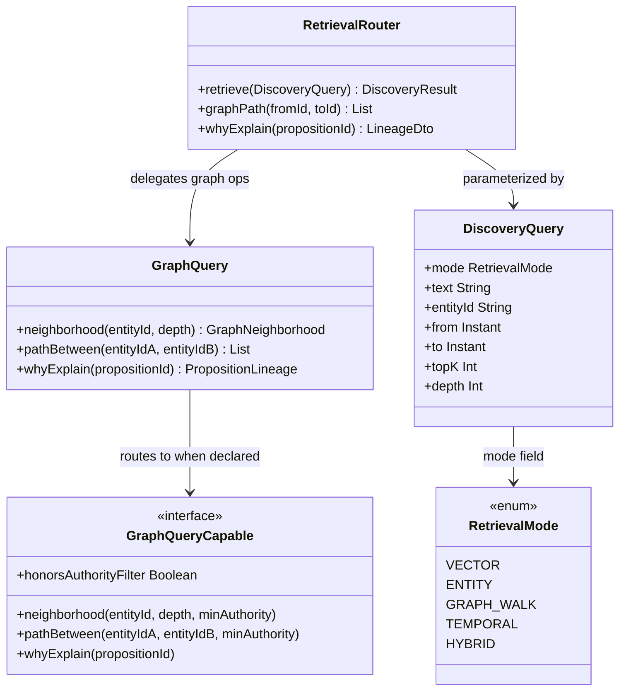
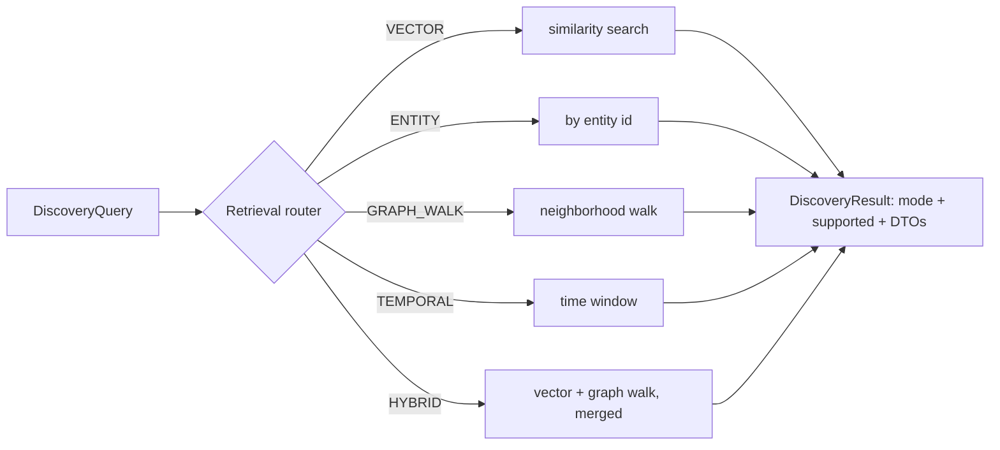
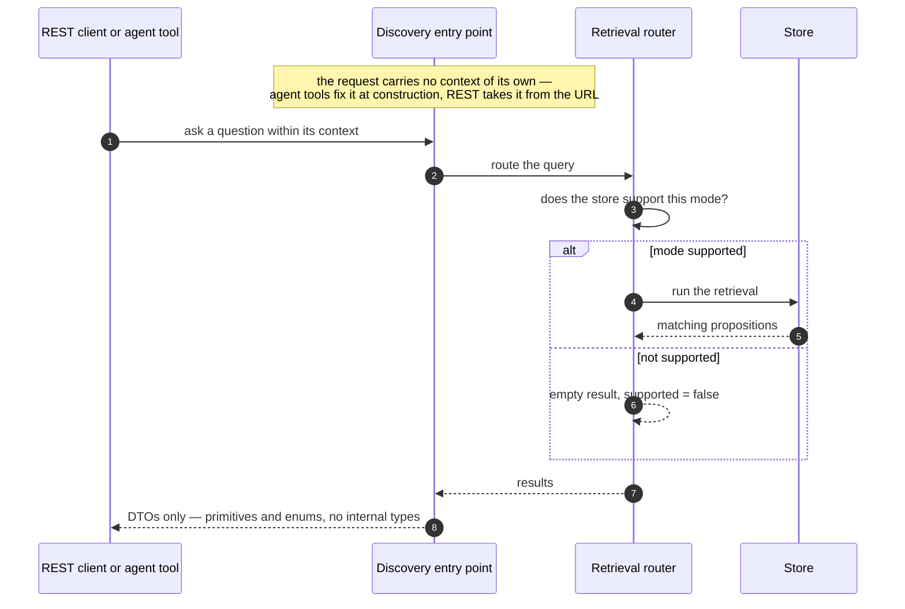
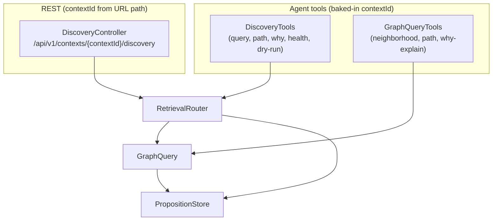
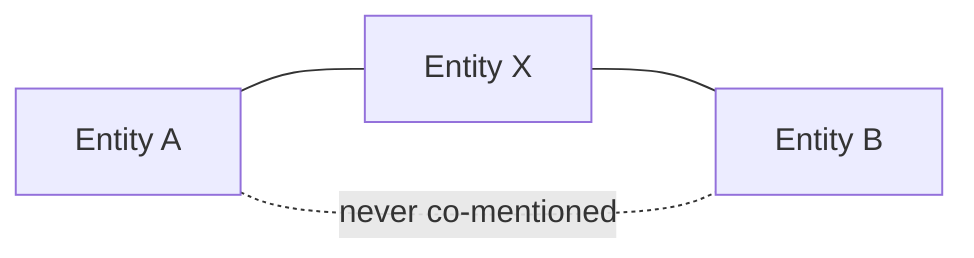

# Retrieval and discovery

Once DICE holds a body of propositions, the interesting question is how you get knowledge back out.
Direct lookup ("what do I know about Alice?") is the easy part. The decisions worth explaining are
the ones around *how* retrieval stays honest across different backends, why trust filtering happens
when you read rather than when you write, how the system surfaces connections nobody queried for,
and why it can explain itself. This note is about those choices.

## The query surface: SPIs and entry points

Three things give callers access to propositions: the `GraphQuery` facade (portable entity-graph
operations), the `RetrievalRouter` (mode-routed multi-modal retrieval), and the agent tools and
REST controller that wrap both.

`RetrievalRouter` is the single entry point for mode-routed queries. `GraphQuery` is the portable
graph facade — it walks propositions hop-by-hop over whatever store is underneath, routing to a
native `GraphQueryCapable` backend when one declares the capability. Agent tools (`DiscoveryTools`,
`GraphQueryTools`) and the REST surface (`DiscoveryController`) wrap these from the outside,
baking in the `contextId` so a caller can't cross context boundaries.

## Store-agnostic graph queries

Neighborhood, path, and lineage queries don't require a graph database. A proposition that mentions
two resolved entities already *is* an edge between them, so the portable query surface answers
graph-shaped questions by walking propositions one hop at a time over whatever store is underneath.
A native graph backend gets routed to first when it can do the traversal faster, but the portable
walk is always there as the floor.

The decision behind this is that graph-shaped *reasoning* shouldn't be chained to graph
*infrastructure*. A lightweight in-memory setup should still answer "how is A connected to B?"
without standing up Neo4j. And when a capability genuinely isn't there, these operations return
empty or null rather than throwing — asking a question the backend can't fully answer gives you
"nothing found," not an error.

```mermaid
flowchart TD
    GQ["GraphQuery.neighborhood(entityId, depth)"] --> CAP{"store implements<br/>GraphQueryCapable?"}
    CAP -->|"yes AND honorsAuthorityFilter"| NATIVE["route to native neighborhood()<br/>with minAuthority"]
    CAP -->|"yes, no authority filter"| NATIVEPLAIN["route to native neighborhood()"]
    CAP -->|"no"| PORTABLE["portable walk: follow proposition<br/>mentions hop by hop"]
    NATIVE --> RESULT[GraphNeighborhood]
    NATIVEPLAIN --> RESULT
    PORTABLE --> RESULT
```

## Query-time authority filtering

Graph queries take an optional authority floor. Edges below it are dropped *during* the traversal,
with authority re-resolved from each proposition's provenance as the walk proceeds — nothing is
filtered out at write time.

This is a deliberate tradeoff. Trust policy changes more often than data does, and different callers
want different floors over the same facts. Baking a trust cutoff into stored edges would mean
re-ingesting everything whenever the policy moved, and would force one global standard on every
consumer. Filtering at read time keeps the stored graph complete and lets each query decide how
cautious to be. The safe-fail detail matters here: a proposition with no provenance resolves to the
weakest tier, so any non-trivial floor drops it — unknown provenance is treated as low trust, not
waved through.

The `GraphQueryCapable.honorsAuthorityFilter` flag is how a native backend opts in to handling the
filtering itself. When it is false (the default), the portable facade applies authority filtering
on its own proposition-walk, so the correct result comes back either way. A backend sets it to true
only after it genuinely honours the `minAuthority` argument in its `neighborhood` and `pathBetween`
overloads — and if it sets the flag without overriding those overloads, the default bodies throw
rather than silently returning unfiltered results.

## Single retrieval entry point

There are several ways to find propositions — by vector similarity, by entity, by walking the graph,
by time window, or a hybrid that blends similarity with graph neighborhood. Rather than make callers
know which of these the backing store can do and how to combine them, DICE puts a single router in
front of all of them.

The router checks whether the backing store actually supports a mode and, if not, returns an empty
result that *says so* (`supported = false`) rather than silently falling back to a full scan. It also
clamps result size and traversal depth before doing any work. The reason for one entry point is that
the caller — a REST client, an agent tool, internal code — shouldn't have to reason about the store's
capabilities; that's exactly the knowledge the router is there to hold.

## DTO boundary and context isolation

Everything that crosses out to a caller is a DTO of primitives and enums — never an internal type
like a proposition or a store handle. And the request itself never carries a context of its own: the
agent tools fix the context when they're constructed, and the REST layer takes it from the URL path.

Two concerns drive this. One is a stable external contract: internal types can evolve without
breaking the wire, and a leak-check guards against a domain type sneaking into a DTO by accident. The
other is isolation — because the request body has no context field, a caller *cannot* ask one
context's endpoint for another context's data. Cross-context reads aren't forbidden by a check;
they're structurally impossible, and an LLM given the agent tools can't wander across context
boundaries either.

## Agent tools and REST surface

Both the agent tools and the REST controller wrap exactly the same router and record stores,
so behavior is identical whether the caller is an LLM agent or a REST client.

`DiscoveryTools` and `GraphQueryTools` are registered as `List<Tool>` via their `asTools()` factory
and added to an agent's tool set alongside `Memory`. `DiscoveryController` activates only when
`spring-webmvc` is on the classpath and a `PropositionStore` bean is present; it is not
component-scanned and must be imported via `DiceRestConfiguration`.

## Serendipitous link discovery

A direct query needs an anchor — you have to name the thing you're curious about. But some of the most
valuable knowledge is the connection you didn't know to look for. DICE surfaces these: it scans a set
of propositions, builds the co-mention graph, and reports pairs of entities that are never mentioned
together yet are both linked to a shared third entity.

The design decision is that this is *proactive* rather than reactive — anchorless discovery instead of
anchored lookup. It's kept purely structural and deterministic (two hops over co-mention edges, over
active propositions only), which makes it cheap and reproducible. And it deliberately reports only
evidence quality, not a "surprise" ranking — the confidence on a discovered link reflects how well
the evidence supports it, and judging which links are *interesting* is left to the consumer. Each
discovered link starts as a candidate and carries a review state, because suggesting a connection and
accepting it as known are different acts.

## Explainability: rationale and reports

DICE can produce a rationale for a proposition — an explanation of *why* it's held, citing the
evidence behind it — and a structured report that aggregates a set of propositions by status, level,
and confidence. The rationale is interpretive, so it's generated by a language model behind an
interface that isolates that dependency (and treats the proposition text it embeds as untrusted
input, since it originally came from ingested documents). The structured report is the opposite: pure,
deterministic aggregation with no model in the loop, so it's reproducible and safe to build on.

The reason both exist is that a knowledge system you can interrogate is one you can trust. "Why do you
believe this?" should have an answer that points at evidence, and "summarize what you know here"
should give the same result every time.

## Configurable behavior

The store capabilities behind the retrieval modes, the authority resolver behind query-time
filtering, the link discoverer, and the rationale generator are all pluggable. The defaults are
conservative and honest — degrade rather than guess, treat unknown provenance as low trust, report
evidence rather than a ranking — and a deployment swaps in sharper judgment where it needs it.
